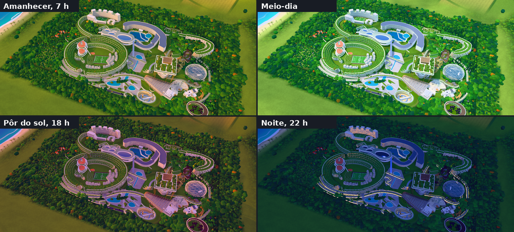
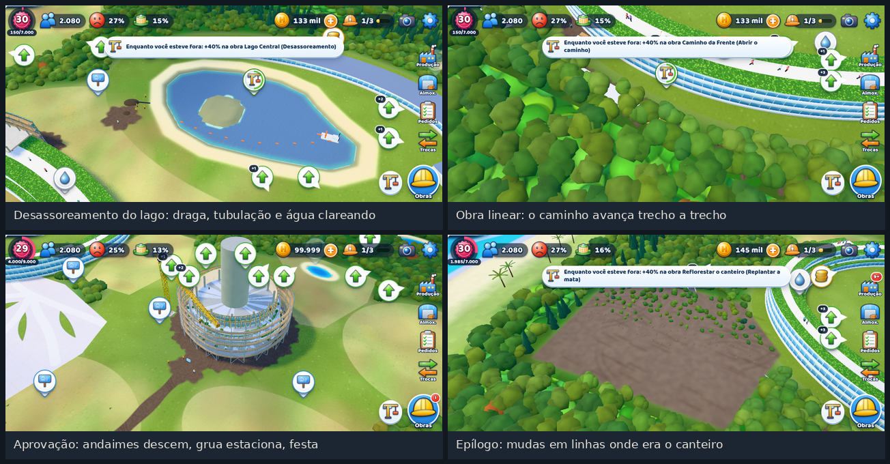

# Arcologia de Held: composição total

Jogo de construção no estilo **SimCity BuildIt**, em 3D, feito para celular (testado para o Poco X7) e que também roda no computador. A única obra do jogo é a **Composição Total da Arcologia de Held**, com todas as estruturas da foto em `arte/originais/composicao-total-arcologia-de-held.png`, construídas como uma cidade viva no visual do BuildIt: dia claro e colorido, ciclo de dia e noite, praia, mar e morros em volta. Cada estrutura segue a arquitetura da foto de referência (arena em grelha com torres, colinas de terraços verdes, anel de varandas brancas, rede de bandas com vidraçaria espelhada, torre em vaso com jardim na cobertura, cúpula geodésica), com as cores limpas e vivas do BuildIt. Ela começa como pasto degradado cercado de mata e cresce etapa por etapa, com canteiro, andaimes, grua e operários, até ter cada componente da foto no lugar.

**Jogar:** https://diogoholanda2026-cell.github.io/diogo/ (atualiza sozinho a cada envio ao GitHub).

| Composição total, de dia | Planta holográfica no início |
|---|---|
|  |  |

| Obra em andamento | Prancha de entrega | Usina de materiais |
|---|---|---|
|  |  |  |







## Instalar no celular (recomendado)

O melhor formato para este jogo é um **app instalável (PWA) servido pelo GitHub Pages**. No Poco X7:

1. Abra o link acima no **Chrome**.
2. Menu ⋮ → **Instalar app** (ou "Adicionar à tela inicial"). Se nada acontecer, dê ao Chrome a permissão **Atalhos na tela inicial** nas configurações do HyperOS.
3. Abra pelo ícone. O jogo roda em **tela cheia, em paisagem**, **funciona sem internet** e se atualiza sozinho quando houver versão nova.
4. Em Configurações do jogo, confira se aparece "Armazenamento protegido": assim o Chrome não apaga o progresso quando o celular enche.

Para jogar a **120 qps**: o Chrome para Android limita jogos a 60 qps em telas de 120 Hz. Até o Chrome 156 (que libera 120 Hz em tela cheia), desative `chrome://flags/#throttle-main-thread-to-60hz`, deixe a tela do celular em 120 Hz e escolha 120 nas configurações do jogo. 60 qps esquenta menos e gasta menos bateria.

### Por que PWA e não um app próprio (APK)

| | Navegador | **PWA instalada** | APK (Capacitor/TWA) | Motor nativo (Unity/Godot) |
|---|---|---|---|---|
| Desempenho 3D | igual | **igual** | igual (mesmo Chromium) | um pouco melhor |
| Tela cheia e paisagem travada | limitado | **sim** | sim | sim |
| Offline | não | **sim** | sim | sim |
| Atualização | automática | **automática** | reinstalar APK | reinstalar APK |
| Instalação no Poco X7 | nenhuma | **um toque** | sideload (o Google anunciou verificação obrigatória de desenvolvedores no Brasil a partir de 30/09/2026) | sideload |
| Salvamento | pode ser apagado | **protegido** (`storage.persist`) | "transitório" (WebView) | arquivo local |

A PWA usa o mesmo renderizador que um APK usaria, sem o atrito de instalar APK, e recebe cada melhoria assim que o código é enviado. Um motor nativo exigiria reescrever tudo por um ganho pequeno.

## Como jogar

O ciclo é o do SimCity BuildIt, adaptado a uma obra fixa e pensado para **4 visitas curtas por dia**: em cada visita o jogador enche as filas em lotes, entrega, aprova e decide o que acelerar; o canteiro trabalha e a produção entra sozinha no Almoxarifado enquanto o jogo está fechado.

1. **Calendário:** um dia do jogo dura **20 segundos** reais (mês de 30 dias, ano de 360 dias = 2 horas), contado pelo relógio real desde a criação do jogo, inclusive fechado. O calendário pequeno do HUD mostra dia, mês e ano.
2. **Usinas de Materiais** (a primeira e a terceira, com até 6 espaços) produzem matérias-primas em paralelo: madeira certificada, brita reciclada, aço reciclado, argila, sementes nativas, vidro, cobre e fibra de bambu. Cada espaço faz um **lote de 1 a 10** (escolhido com + e −); 10 unidades levam 8 vezes o tempo de 1. Um espaço marcado como **automático** recomeça o mesmo lote assim que o anterior é coletado.
3. **Oficinas** (Carpintaria, Central de Concreto, Horto, Serralheria, Vidraçaria, Oficina Elétrica e Laboratório de Campo) fazem os produtos em **fila de até 9 trabalhos, um de cada vez**, e cada trabalho também é um lote de 1 a 10, limitado pelo que há de insumo no Almoxarifado (os insumos saem na hora). Quanto mais avançado o produto, mais tempo leva (níveis 1–2 ×0,75, 3–4 ×1, 5–9 ×3, 10–14 ×5, 15+ ×8): uma fila cheia rende a noite inteira. A oficina também tem modo automático: repete o item escolhido, em lotes, enquanto houver insumos e vaga. **Encomenda em cadeia:** uma unidade pode entrar na fila sem os insumos; ela espera, puxa os insumos quando ficam prontos, nunca segura a fila e sai sozinha depois de 12 h sem insumos.
4. **Coleta automática:** todo lote pronto vai direto para o **Almoxarifado** (120 vagas no começo, +40 por ampliação com estrados, etiquetas e cadeados, que caem ao coletar produção e ao subir de nível). Se ele lotar, o resto espera no espaço ou na bandeja da oficina (com a bandeja cheia, 9 itens, a fila para) até você coletar.
5. **Obras:** cada estrutura da foto tem de 1 a 5 etapas. Na **prancha**, entregue os materiais aos poucos, pague os créditos e inicie. As obras ficam mais longas a cada capítulo (de minutos no capítulo 1 a horas no 5). Ao aprovar, a Holding paga a **recompensa: 150% do que a etapa custou** (créditos pagos mais o valor dos itens entregues) e dá **2 aceleradores**, um de obra e um de produção; cada acelerador adianta **1 hora** de uma obra ou pavimento em andamento, de todos os espaços de uma usina ou do trabalho da frente de uma oficina.
6. **Módulos:** os edifícios-fita (Anel do Campus, Campus Universitário, Anel da Biblioteca, Santuário com 4 pavimentos e as casas da Vila) crescem um pavimento por nível; cada pavimento aprovado também devolve 150% do que custou.
7. **Serviços e bem-estar:** do nível 3 em diante os moradores pedem **água**; do 4 em diante, **energia e saneamento**; o último pavimento pede **70% de bem-estar**. O bem-estar é 35 + as obras de lazer + as escolhas do Conselho − 1 ponto a cada 200 moradores: morar mais gente pede mais praça, escola e verde. No fim do capítulo 3 fica em torno de 77% (cerca de 82% com as escolhas que cuidam das pessoas, 67% com as que aceleram a obra); por isso, no capítulo 4, quem escolheu acelerar precisa do palco do anfiteatro e do Centro de Física antes de subir o Anel ao 5º pavimento.
8. **Renda dos moradores:** cada morador paga, **por hora real**, 5 créditos com bem-estar geral até 30%, 8 de 31% a 60% e 11 de 61% a 100% (1.500 moradores na faixa de até 30% rendem 7.500 por hora). O cofre da Sede (antes dela, do Escritório) guarda até **12 horas** de renda; com o jogo fechado rendem no máximo 12 horas, pela metade.
9. **Escritório e finanças:** o **valuation** da construção sobe sozinho conforme ela avança (etapas e pavimentos a 150% do que custaram, prédios e ampliações pelo preço, 100 por morador e o caixa, que é os créditos menos a dívida), com o recorde guardado. O **empréstimo** dá até **50 mil por ano do jogo**, em passos de 1.000, com dívida total (principal mais juros devidos) de até **500 mil**, juros de **10% ao ano** sobre o principal e prazo de **10 anos** por contrato; depois do prazo o saldo rende mora de 20%. Dá para pagar só os juros (e ficar devendo o principal), pagar juros + uma parcela de 10% do principal (mínimo 1.000, abatendo os contratos mais antigos) ou quitar tudo.
10. **Mutirão e disposição:** a comunidade ganha **disposição** (+2 por pedido, +4 por módulo, +8 por etapa, +30 por marco); a cada 100 pontos vem uma **ficha de Mutirão** (teto de 3). Uma ficha adianta até **2 horas** de um cronômetro (na usina, todos os espaços; na oficina, o item atual).
11. **Licenças:** obras grandes pedem topografia. **Estacas** vêm da madeira (0,6%), **balizas** da Serralheria (3%) e **trenas** da Oficina Elétrica (3%). O **Topógrafo** do Escritório faz uma por vez: estaca (2 madeira + 300, 20 min), baliza (2 aço + 600, 30 min), trena (2 cobre + 900, 45 min).
12. **Pedidos da comunidade** (do capítulo 2 em diante: 3 cartões, 4 no capítulo 3, 6 depois) têm quem pede, onde mora e por quê. Pedem **5 vezes mais** itens do que antes (10 a 25 matérias-primas, 5 ou 10 produtos por tipo) e pagam **150% do valor** dos itens em créditos, além de experiência e licenças, itens de almoxarifado, bem-estar por 24 h ou disposição. O quadro mostra o total de cada item somando todos os pedidos. A **Usina de Pedidos da Comunidade** (a antiga Usina de Materiais II, no nível 7) só fabrica o que está nos pedidos: toque em "Fabricar" num pedido e os três espaços dela produzem em paralelo o que falta (matéria-prima e produtos, usando os insumos do Almoxarifado), com coleta automática.
13. **Depósito de Trocas:** 10 unidades de cada matéria-prima a cada 4 horas, com o preço subindo 12% a cada compra; **vende por 150% do preço base de compra** (4,5 × o valor do item), até **100 vendas** por janela de 4 horas.

Tudo segue rodando com o jogo fechado: ao voltar, usinas e oficinas andam em passos de 5 minutos (uma pode esperar o produto da outra, e o automático continua até lotar o Almoxarifado), os juros do empréstimo e o calendário contam o tempo real. Jogando quatro vezes por dia, a composição inteira leva de uma a duas semanas; em Configurações, **Ritmo da obra 2× ou 4×** encurta todos os cronômetros.

### A história e a ordem da obra

Cinco capítulos e um epílogo, com conselheiros (Íris, arquiteta-chefe; Tomé, engenheiro de materiais; Nara, bióloga; Caio, físico; Dona Cida, voz dos moradores). A ordem segue a lógica de uma obra real: primeiro o acesso, a água e a administração; depois moradia, escola e praça; em seguida biblioteca e faculdades; o acelerador subterrâneo e a vila; por fim os habitats dos animais. Cada etapa aprovada tem uma fala do conselheiro da área; ao cumprir 1/3 e 2/3 das metas de um capítulo vem um **marco** (fala, disposição e créditos).

No fim de cada capítulo o Conselho apresenta um **dilema** sobre o que vem pela frente: a primeira opção cuida das pessoas (bem-estar), a segunda acelera a obra, e cada uma tem um custo. Canteiro compacto × amplo; Biblioteca aberta dia e noite × Laboratórios primeiro; Telhados solares × Geotermia profunda; Elefantes × Aquário primeiro; e, para o replantio do epílogo, Tarifa social da água (+6% de bem-estar, replantio 30% mais caro) × Água para a obra (Horto 20% mais rápido e replantio 40% mais curto, −3% de bem-estar). O epílogo lembra as escolhas.

1. **Fundação:** canteiro, Caminho da Frente, desassoreamento do Lago Central, Sede da Holding e os primeiros módulos do Anel. Um tutorial curto (4 a 6 minutos) leva da primeira brita ao primeiro módulo: um anel dourado pulsa sobre o que tocar (o balão, o botão ou o controle dentro do painel) e o conselheiro explica cada passo.
2. **Água que corre:** margens vivas e estação natural de água, Escola e Campus para Jovens, campo, Praça Central com jardins filtrantes, Bulevar Verde, anel de vidro solar da Sede.
3. **Saber de madeira:** Biblioteca Central (núcleo, andares, pilares-árvore, dossel), Centro de Recursos Digitais, Faculdades de Humanidades, Engenharia e Ciências, Instituto de Estudos Urbanos, Campus Universitário, Ala em Onda, pontes.
4. **Energia escondida:** Acelerador de Partículas (poço, anel, detectores, Centro de Física), anfiteatro e casas da Vila Estudantil.
5. **Casa dos gigantes:** Santuário com 4 pavimentos, habitats da savana com elefantes, girafas e rinocerontes, Bioma Aquático (cúpula geodésica com aquário) e Recinto dos Gorilas. Os materiais do santuário (nós, cúpula, acrílico, ração, kits veterinários) só aparecem aqui.
6. **Composição total:** desmontar o canteiro (as oficinas descem para galpões sob o acelerador) e replantar a mata. As duas pranchas aceitam materiais já no capítulo 5 e as obras do epílogo são curtas de propósito (fator de obra 0,15), então o final acontece em uma ou duas visitas, como uma festa.

### Equilíbrio medido por um robô

`ferramentas/simular.mjs` joga a partida inteira sozinho, no ritmo contínuo ou em **4 sessões de 15 minutos por dia** (7:30, 12:30, 18:30 e 22:00), produzindo em lotes (o tamanho vem do que a próxima etapa pede), com o espaço 1 da Usina de Materiais em automático enquanto o plano pede o item, usando os aceleradores das etapas, fabricando um pedido por vez na Usina de Pedidos e vendendo sobras no Depósito quando falta crédito. Mede a duração de cada capítulo, onde a obra trava, quanto as oficinas trabalham, créditos, valuation, renda, dívida, lotes, aceleradores, fichas, pedidos e obras simultâneas. `npm run simular:todos` roda testes de regra (lotes e coleta automática, automático, cadeia, tempo fechado, calendário, empréstimo, renda por faixa e offline, recompensa e aceleradores, valuation, pedidos e Usina de Pedidos, migração de saves v1 e v2, depósito, topógrafo, marcos, falas, e o cenário "juros e limites", em que o jogo começa sem crédito e o robô toma empréstimo, paga juros e quita), confere que nenhuma ordem de obra pode travar serviços ou bem-estar, e uma matriz de 9 combinações, e sai com erro se algo sair das faixas:

- capítulo 1 em 30 a 45 minutos de jogo contínuo; em sessões, o jogo inteiro em 7 a 12 dias, cada capítulo do 2 ao 5 em 0,75 a 4 dias e o epílogo em até 8 horas (antes da economia nova eram 12 a 16 dias: lotes, coleta automática e aceleradores encurtam cada capítulo em cerca de um terço);
- créditos: com recompensa de 150% e renda por morador, os créditos crescem o jogo inteiro (de cerca de 10 mil no fim do capítulo 1 a milhões no epílogo, com renda de até 117 mil por hora com 10.700 moradores felizes); não há inflação de preços porque nada é reprecificado, e o que se confere é que crédito nunca vira parede a partir do capítulo 2 (bloqueio por crédito em no máximo 10% dos turnos) e que o capítulo seguinte está pago no fim de cada um; oficinas ocupadas pelo menos 15% do tempo; ao menos 3 níveis no capítulo 5;
- o robô produz mais de 500 unidades em lotes e usa o automático, pelo menos 50 aceleradores e a Usina de Pedidos em cada partida, e termina sem dívida; no cenário com empréstimo, toma entre 1 mil e 100 mil e termina no mesmo prazo;
- bem-estar entre 70% e 85% (média) no fim do capítulo 3, sem chegar a 100% antes do capítulo 5; saneamento bloqueia alguma vez, mas nunca mais de 25% dos turnos de um capítulo;
- com Mutirão, no máximo 30% das fichas perdidas no teto; com o Depósito, o jogo encurta no máximo 15%; licenças e saneamento pesam de verdade, mas nunca travam;
- a encomenda em cadeia termina sem trava; a "Meta em foco" (o robô que só segue `J.planoMeta()`, que também manda coletar a bandeja cheia, subir módulos em paralelo, adiantar produção em lotes, pré-entregar o epílogo, ampliar o que trava e vender no Depósito quando não há moradores pagando) termina em 10 a 16 dias, com o epílogo em até 8 horas;
- ao menos 3 dos 5 dilemas mudam o tempo em 8% ou mais e nenhum passa de 20%; o do capítulo 5 é medido no epílogo, que não pode passar de 3 horas no contínuo.

Números medidos (sessões, escolha 0): 9,0 dias; capítulo 1 em 5,7 h, 2 em 54 h, 3 em 48 h, 4 em 51 h, 5 em 58 h, epílogo em 12 min; créditos no fim de cada capítulo 5 mil, 348 mil, 1,6 milhão, 4,0 milhões e 7,6 milhões; 140 aceleradores usados, 4 mil unidades em lotes; valuation final 10,3 milhões. No contínuo, 3,4 a 3,8 dias. A Meta em foco leva 12,5 dias (1,4 × o robô normal, porque não usa aceleradores nem a Usina de Pedidos).

O mesmo robô roda no GitHub Actions a cada envio. As consultas e eventos que a interface usa (calendário, empréstimo, valuation, lotes, coleta automática, automático, aceleradores, renda, Usina de Pedidos, tutorial, Meta em foco, progresso das metas, falas, avisos, disposição, topógrafo, depósito, serviços, pedidos e escolhas) estão descritos no começo de `fonte/sim/estado.js`, e a interface mostra todos eles (veja **Interface**).

### Salvamento

O jogo grava no navegador a cada 12 segundos e ao sair, esconder ou congelar a aba: primeiro no localStorage (na hora) e depois no IndexedDB; ao abrir, lê os dois e fica com o gravado por último. Importar um arquivo (ou apagar o progresso) trava a gravação até a página recarregar, para o jogo da memória não gravar por cima. Um save de versão antiga é **migrado** (com uma cópia de segurança antes) e nunca recomeça o jogo: o save versão 3 (economia nova) recebe o calendário contado desde a criação do jogo, empréstimo vazio, aceleradores zerados e lotes de 1 nos espaços e filas, sem perder nada; um save danificado fica guardado à parte e o jogo avisa. Em Configurações dá para exportar e importar o save em arquivo.

## Interface

A interface é a **prancheta da maquete**: o HUD fica nas bordas, em vidro escuro, com texto branco de contorno limpo, e os painéis são folhas de papel quente com cabeçalho azul-noite, detalhes em latão e madeira clara, como a arquitetura da foto. A cidade fica sempre à vista (o HUD em repouso ocupa cerca de 15% da tela). Pensada para a tela 20:9 em paisagem (986x443 no Poco X7): tudo que se toca tem pelo menos 44 px, os textos têm pelo menos 12 px e usam a fonte arredondada Baloo 2 (embutida, funciona sem internet).

- **No alto à esquerda:** o selo de nível é o Anel do Campus visto de cima (a experiência enche o terraço verde), e as pílulas mostram moradores com a renda por hora, bem-estar (uma folha verde, amarela ou laranja), composição concluída (com anel de progresso) e o **calendário** (20 s por dia, com o anel do dia). **No alto à direita:** créditos (tocar abre o Escritório), Trocas, **Mutirão** com os aceleradores, Apreciar e Configurações.
- **Toque longo** em qualquer pílula, botão ou espaço de produção explica o que ele é e onde conseguir mais.
- **À direita**, Produção, Estoque, Pedidos e Trocas; os que ainda não abriram ficam no lugar com um cadeado e dizem em que capítulo abrem. **Embaixo à direita**, o botão grande de **Obras** com o capacete e aro de latão.
- **Embaixo à esquerda:** a medalha do capítulo abre as metas numa coluna, com o progresso de cada uma, o prêmio do capítulo e **Apresentar ao Conselho** quando tudo está cumprido; se a decisão ficar para depois, a medalha ganha um selo de latão. Ao lado, a pílula **Agora** com a próxima ação concreta (no tutorial, o cartão do passo, com um check ao cumprir). Só uma chamada de ação aparece por vez.
- **Falas do conselho** entram na faixa de baixo, letra a letra, com o retrato de quem fala, e recolhem para o retrato em 4 s (um toque reabre); com um painel aberto viram uma linha presa à folha. Os brindes aparecem no canto de cima, no máximo dois.
- **Painéis** são folhas de papel à esquerda com a miniatura da obra recortada da foto de referência e a ação principal num rodapé fixo. A **prancha da obra** tem um botão só, que muda de estado (Entregar 4 materiais, Iniciar obra, Faltam 3 materiais) e mostra o custo em moedas e em tempo. O **módulo** mostra barrinhas de água, energia e saneamento e, quando não pode subir, o motivo com um botão **Ir** para a obra que resolve. **Obras** e **Produção** mostram o estado de cada uma (pronta para aprovar, faltam materiais, em obra, bloqueada). Nas usinas e oficinas cada espaço produz lotes de 1 a 10 (− e +), com **Auto** para repetir sempre o mesmo produto, **x** para cancelar e coleta automática para o Estoque.
- **Escritório:** a aba **Finanças** tem o **Valuation** da construção (obras, pavimentos, prédios, moradores e caixa, com o recorde), a renda dos moradores e o cofre, e o **Empréstimo** (até 50 mil por ano e 500 mil de dívida, juros de 10% ao ano do jogo, pagar só os juros, parcela mais juros ou quitar, contratos de 10 anos). A aba **Obra e serviços** tem água, energia, saneamento, bem-estar e o Topógrafo.
- **Pedidos:** cartões com quem pede, a fala e a recompensa, os **totais por item** no alto e o botão **Fabricar na Usina de Pedidos**; tocar num pedido completo mostra o resumo antes de entregar. O **Depósito de Trocas** vende a 150% do preço de compra, até 100 vendas a cada 4 horas.
- **Balões** são círculos brancos com aro pela intenção, flutuam devagar e um de cada vez balança para chamar atenção; perto da câmera mostram o verbo (Coletar, Aprovar). Os **rótulos 3D** são legendas de maquete, curtas, com uma linha até a estrutura, e nunca ficam sob o HUD.
- **Aprovar:** uma placa de latão com o nome da obra bate no mesmo instante em que o andaime desmonta e depois voa até a próxima etapa; o modal mostra a recompensa (150% do custo) e os aceleradores ganhos.
- **Modais** em dois tons; o **Conselho** mostra as falas alternadas e, em cada escolha, o antes e depois do que muda.
- **Configurações** em seções: vídeo, som e toque, luz e ciclo (**Foto**, o padrão, Acelerado, Hora do celular ou Sempre dia), ritmo, salvamento e acessibilidade (**Tamanho da interface**, **Reduzir movimento** e **Alto contraste**).
- `ferramentas/vitrine-ui.mjs` captura a interface no celular (986x443 e 915x412) sem WebGL, cena por cena, e mede alvos de toque, tamanho de texto, área do HUD, cobertura da composição e chamadas de ação.

## Controles

- **Um dedo:** arrasta o mapa (com inércia). **Pinça:** aproxima. **Torcer dois dedos:** gira. **Dois dedos para cima/baixo:** inclina.
- **Toque** numa construção, num lote ou num balão. **Toque duplo:** aproxima naquele ponto. Arrastar o dedo por vários balões de coleta recolhe todos.
- **Próximo** e **Ir** levam até a próxima ação. Tocar na cidade fecha a folha e o cartão das metas.
- **Apreciar** (ícone de câmera no alto): esconde o HUD e a câmera passeia devagar. Tem um **X** fixo para sair, a placa de latão com a composição, o capítulo e a estrutura em foco, e a barra com **Fotografar**, **Comparar** e **Mais**. **Comparar** divide a tela com um cabo arrastável (a obra de um lado, a foto de referência do outro, no mesmo enquadramento e à noite, como a foto); segurar mostra a foto inteira enquanto o dedo fica. **Mais** tem Vista geral, **Enquadrar** (Sede, Ciências, Biblioteca, Bioma, Praça e Anel), Rótulos, Planta e a hora do dia. **Fotografar** gera um cartão com o quadro do jogo e o recorte da foto de referência lado a lado, para salvar ou compartilhar. Com som ligado, pássaros e água ao fundo.
- No computador: arrastar move, roda do mouse aproxima, botão direito gira e inclina.

## Gráficos

No padrão visual da foto de referência, num mundo aberto, feito para o Mali-G615 MC2 do Poco X7. A composição inteira cabe em cerca de 160 chamadas de desenho e 395 mil triângulos, contando a sombra e os arredores.

- **Estruturas fiéis à foto:** cada componente foi refeito a partir da foto de referência sem legendas, ampliada região por região. O **Campus Universitário** é uma arena oval de parede em grelha de células, com cinco torres na platibanda e o campo com pista dentro. O **Anel do Campus** é uma colina de terraços verdes em volta do campo, com os pátios da escola em morros de terraços e a cidade de blocos brancos das faculdades. A **Sede** é um anel de varandas brancas em volta do parque com o lago, a ilha e o pavilhão de cobertura plana (o guarda-chuva). A **Faculdade de Ciências** é uma rede de bandas boleadas com as células cobertas por vidraçaria espelhada. A **Biblioteca** é uma torre em vaso de lajes onduladas com fachada em colmeia, pilares inclinados e um jardim de cobertura com estufa; o **CRD** é um casco em leque de madeira e vidro. O **Santuário** é uma fita em laço em volta da mata com lagoa, com o campo e o piquete dos elefantes atrás. No leste, a **cúpula geodésica** do Bioma, a **Vila** de casas empilhadas junto ao anfiteatro escavado, o recinto dos **gorilas** com a galeria em anel e a bacia do **acelerador** em degraus. Em volta, a mata em três tipos de árvore com ciprestes em grupos, trilhas, uma aldeia a oeste e carros nas vias. As referências de arquitetura: Stefano Boeri, BIG, Zaha Hadid, MAD Architects, Kengo Kuma, Shigeru Ban, Moshe Safdie e o Eden Project.
- **Luz da foto (padrão):** a luz quente de exposição vindo de cima e da esquerda, o céu azul-marinho com estrelas e aurora em fitas, as janelas acesas em amarelo quente, piscinas e o aquário do Bioma acesos por dentro, prédios creme com vidro escuro, lagos azul-acinzentados e a mata verde-oliva escura de copinhas miúdas, com os vãos quase pretos, medida região por região contra a foto. Gradação em espaço linear com tonemapping Khronos PBR Neutral, sombras frias e luzes quentes.
- **Dia de BuildIt (opção Sempre dia):** sol quente vindo da esquerda da tela, sombras nítidas caindo para a direita e azuladas pelo céu, verde vivo, água turquesa e prédios claros.
- **Ciclo de dia e noite (opção Acelerado ou Hora do celular):** amanhecer rosa e laranja, hora dourada com sombras longas, dia claro, pôr do sol dourado e lilás, crepúsculo violeta e a noite da foto, com aurora e a lua, janelas que acendem prédio a prédio, postes, fitas de luz nas passarelas, reflexos quentes nos lagos e estrelas. Tudo interpolado sem degraus; a sombra acompanha o sol e só é refeita quando ele anda meio grau.
- **Luz com vida:** sombras de nuvens passando pelo terreno, brilhos do sol cintilando na água, luz de recorte nos contornos, rebote verde da grama, bloom leve de dia e forte à noite, névoa azul-clara ao longe.
- **Arredores:** a obra fica num terreno que continua até o horizonte, com campos, bosques, morros e serras na névoa, praia com coqueiros e mar com ondas e espuma na areia, veleiros e nuvens.
- **Oclusão de ambiente por campo de alturas:** a cidade vista de cima vira um mapa de alturas desfocado, que escurece a base das paredes, os degraus dos terraços, o chão sob as passarelas e a orla da mata. É recalculado só quando a obra muda.
- **Mata em cachos** com vento e três níveis de detalhe por célula; **190 pessoas** nas passarelas, praças e terraços, com figura simples de longe; elefantes, girafas, rinocerontes e gorilas de dorso prateado que andam de verdade; um bando de aves.
- **Obra com sentido físico**: o canteiro monta em 1,6 s (estacas, poeira, mastro telescópico da grua); a grua trabalha num ciclo de içamento de 14 s com pêndulo e nunca cruza prédios prontos; o caminhão entrega e as pilhas no chão de obra correspondem aos materiais entregues; os operários ficam em postos (andaime, laje, pátio) com um mestre de colete; o andaime sobe um lance acima da obra, com diagonais e tela de proteção; o prédio sobe andar por andar, com tampa de seção e concreto fresco. Modos próprios para **draga** (desassoreamento), **caminho** (passarelas avançam trecho a trecho), **plantio**, **caixas** (os bichos saem dos engradados), **terraplenagem**, **pavimentação**, **desmonte do canteiro** e **replantio**. Ao voltar depois de um tempo fora, a obra avança num time-lapse de 1,5 s.
- **Aprovação coreografada**: o andaime desmonta de cima, a grua estaciona, poeira, confete (fogos à noite) e o carimbo APROVADO no mesmo instante; o prédio nunca é achatado.
- Tudo o que fica pronto é **fundido em poucas malhas por material**, em quadrantes que o descarte por caixa esconde fora da tela; a refusão depois de uma aprovação é adiada para não travar.
- Perfis **Ultra, Alta, Média e Leve**, escolhidos pelo processador gráfico (o Poco X7 usa Alta); limite de 30, 60 ou 120 qps; 30 qps com a tela parada.

## Estrutura do código

```
app/                         o jogo montado (PWA publicada no GitHub Pages)
arcologia-de-held.html       o mesmo jogo num arquivo único (abre direto, sem servidor)
arte/originais/              imagens de referência (a foto da composição total)
arte/telas/                  capturas de tela
fonte/
  main.js                    carregamento, motor, mundo, save, primeiro toque
  jogo.js                    liga simulação, mundo 3D e interface
  core/                      utilidades, som procedural, vibração, salvamento (IndexedDB)
  data/                      planta traçada da foto, itens, obras e etapas, história, rótulos
  sim/estado.js              simulação: produção, filas, prancha, módulos, serviços, capítulos
  render/                    motor (pós-processamento), oclusão por campo de alturas (hao.js), câmera,
                             ciclo de dia e noite (ciclo.js), céu, arredores (arredores.js), terreno,
                             floresta, obra animada (obra.js), figuras, animais,
                             descarte de memória (descartar.js) e o mundo
  render/models/             cada estrutura da foto, por etapas
  ui/                        HUD, painéis (folha lateral), balões, ícones desenhados em código,
                             configurações e modo Apreciar
  web/                       HTML, manifesto, service worker, ícones, a fonte Baloo 2 (OFL) e a foto em WebP
ferramentas/
  montar.mjs                 empacota fonte/ com esbuild em app/ e no arquivo único
  simular.mjs                robô que joga do início ao fim (sessões, lotes, empréstimo, escolhas, faixas do equilíbrio)
  robo-partida.js            robô que joga a partida inteira no navegador (pela interface)
  testar.mjs                 capturas de tela no Chromium (WebGL por software)
  vitrine.mjs                conjunto padrão de capturas (composição, closes, obra, celular) para comparar versões
  cap-obra.mjs               capturas de aceite de cada modo de obra, montagem e aprovação
  conexoes.mjs               confere na planta se fitas, passarelas e vias se cruzam
  vitrine-ui.mjs             capturas e medidas da interface no celular, sem WebGL
```

```bash
npm install
npm run montar            # gera app/ e arcologia-de-held.html
node ferramentas/simular.mjs 30 1   # robô: verifica cada 30 min, ritmo 1×
SESSOES=1 ESCOLHA=alt MUTIRAO=1 node ferramentas/simular.mjs 1 1   # 4 sessões de 15 min por dia
SESSOES=1 EMPRESTIMO=1 RELATORIO=1 node ferramentas/simular.mjs 1 1   # cenário com empréstimo e detalhes por capítulo
npm run simular:todos     # testes de regra + matriz de 8 combinações (faixas de equilíbrio)
npm run testar -- /tmp/tela.png "vista=foto&tudo=1"
```

Three.js (licença MIT) vai embutido no pacote; o aviso de licença fica no fim do `app/jogo.<versão>.js`.
