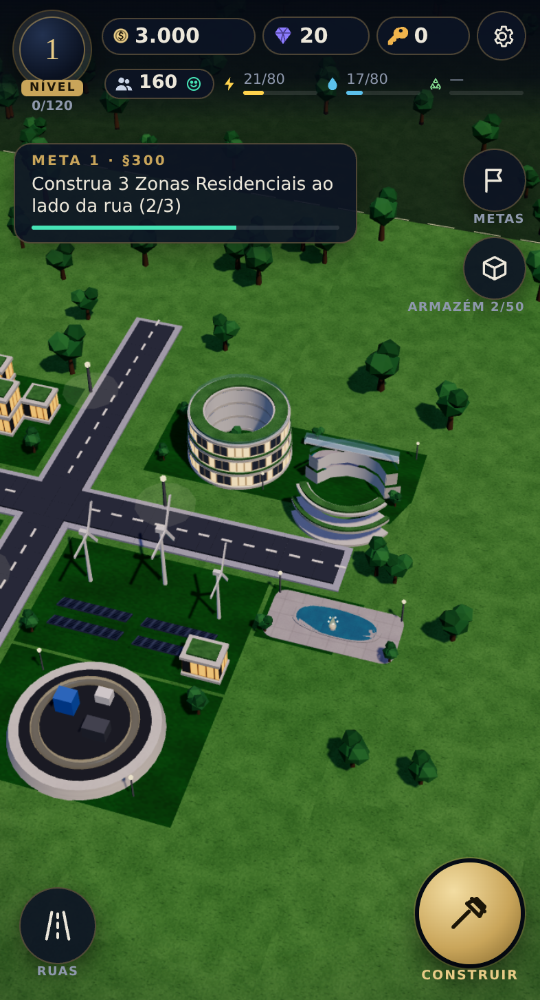
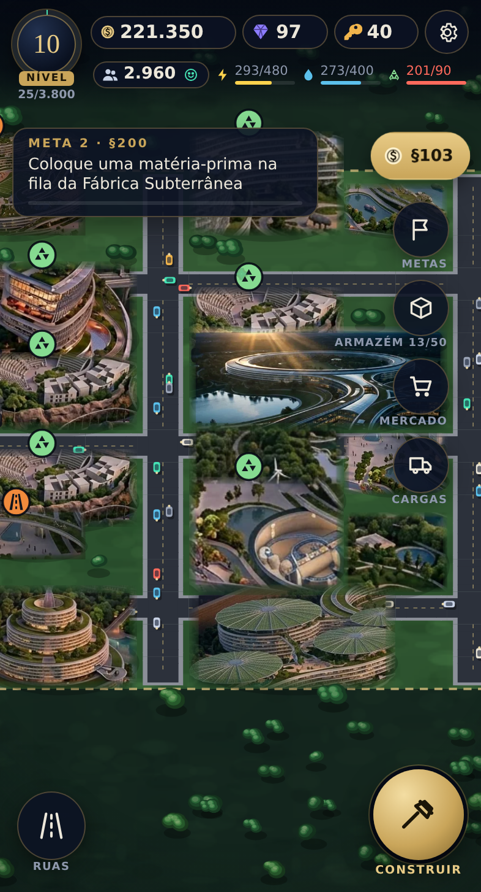
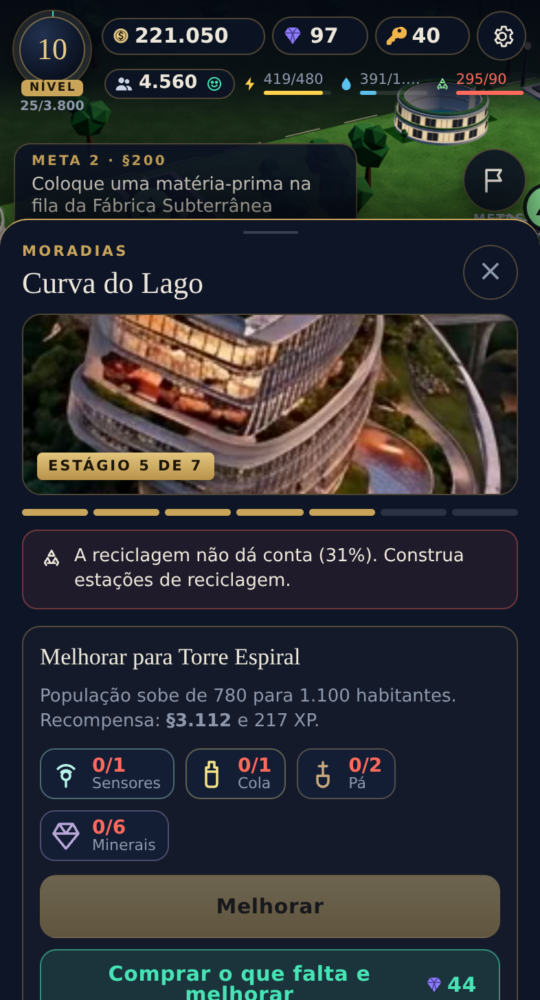
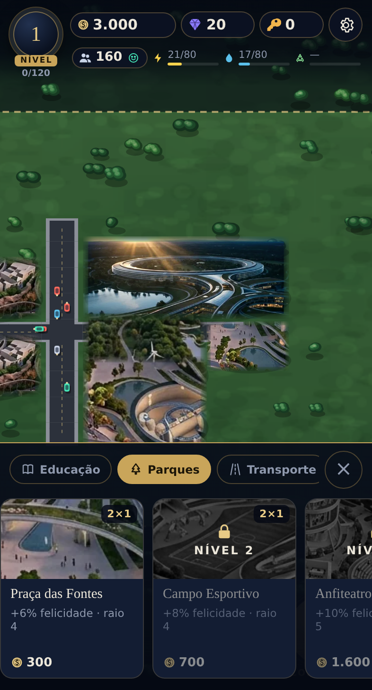
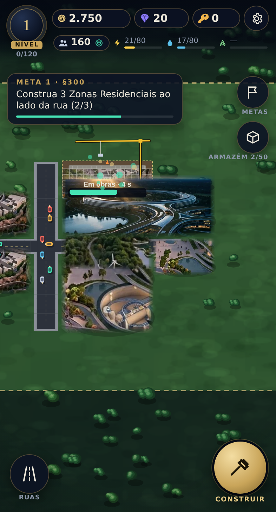
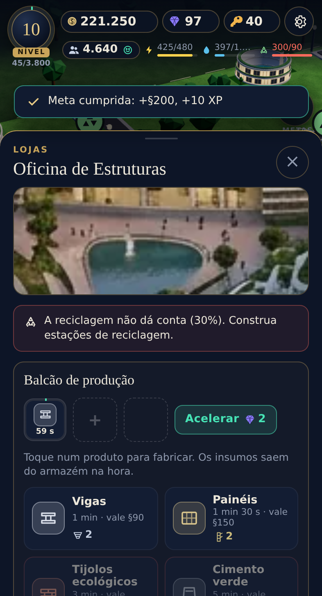
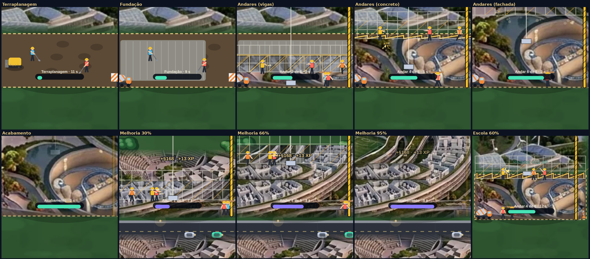

# Arcologia de Held — maquete viva

Jogo de construção de cidade para celular (e navegador de computador), com a **mecânica do SimCity BuildIt** e as **construções recortadas das maquetes da Arcologia de Held** (as seis imagens em `arte/originais`).

**Jogar online:** https://diogoholanda2026-cell.github.io/diogo/ (publicado pelo GitHub Pages a cada push).

Ou abra `arcologia-de-held.html` em qualquer navegador: é um único arquivo, funciona offline, salva sozinho no aparelho e continua rendendo enquanto você está fora.

| Início | Cidade crescendo | Moradia pedindo itens |
|---|---|---|
|  |  |  |

| Menu de construção | Obra passo a passo | Loja produzindo |
|---|---|---|
|  |  |  |

## Como o jogo funciona (o mesmo ciclo do SimCity BuildIt)

1. **Ruas.** Toda construção precisa encostar numa rua ligada à rodovia que entra pela esquerda. Ruas têm três níveis (rua, avenida, via expressa); trechos com muitas construções ficam congestionados e derrubam a felicidade. A **Estação Transit** amplia a capacidade das ruas em volta.
2. **Zonas Residenciais.** Cada zona começa como *Vila Estudantil* e evolui por **7 estágios**, cada um com uma maquete diferente (blocos brancos → terraços do anel → curvas iluminadas → torre espiral → anel residencial). Para melhorar, a moradia **pede itens** (sorteados entre os já liberados no seu nível); ao entregar, você ganha créditos, XP e mais habitantes. Peças de expansão podem cair nas melhorias.
3. **Fábricas** produzem matérias-primas (ligas, bambu, polímero, sementes, minerais, vidro, bioquímicos, fibras) numa fila sequencial. **Lojas** transformam matérias-primas em produtos (vigas, painéis, martelos, vegetais, cadeiras, nanochips…). Itens prontos aparecem numa bolha sobre a construção: toque para coletar. O **armazém** tem limite; amplia-se com créditos e peças.
4. **Serviços.** Energia, água e reciclagem têm capacidade (barras no topo). Segurança, saúde e educação cobrem um raio. Parques e santuários dão felicidade. Cada exigência só passa a valer quando a primeira construção daquele serviço fica disponível no seu nível.
5. **Felicidade e impostos.** A felicidade de cada moradia depende dos serviços, do trânsito e dos parques por perto. Os impostos acumulam na **Sede da Holding** (até 6 h): toque na moeda para coletar.
6. **Comércio.** No **Armazém** há o *Depósito comercial*: ponha itens à venda e o dinheiro entra em minutos. A **Torre do Comércio Global** abre o *Mercado Global* com ofertas de outras cidades (renovam a cada 5 minutos).
7. **Terminal de Cargas.** Encomendas periódicas pedem um conjunto de itens; despache o comboio para ganhar **chaves** (parques grandes e marcos) e **peças de expansão** (terreno e armazém).
8. **Pedidos dos moradores.** Balões de fala aparecem nas moradias pedindo itens por créditos e XP.
9. **Cristais** compram itens que faltam e aceleram filas e obras. Você ganha cristais subindo de nível e cumprindo metas — não há loja nem espera paga.
10. **Marcos (megaestruturas).** As maquetes inteiras — Arco da Holding, Arcologia Circular, Ciência e Educação, Santuário Expandido, Holding e Santuário Global e a composição total **Arcologia de Held** — custam chaves, créditos e produtos, e dão bônus para a cidade toda.

Construir é **passo a passo, com operários**: terraplanagem (trator e operários de pá) → fundação (laje crescendo, betoneira girando) → o prédio sobe **andar por andar** (vigas de aço → concreto → fachada), com andaime, guindaste içando painéis, operários martelando, carregando e soldando (com faíscas) → acabamento e confete. Melhorias de moradia reconstroem por cima da maquete antiga, também andar por andar.



Comandos: um dedo arrasta o mapa, dois dedos aproximam; toque numa construção para abrir a ficha (melhorar, produzir, mover, demolir). No computador, roda do mouse aproxima e `Esc` fecha o que estiver aberto.

## Estrutura do código

```
arcologia-de-held.html          jogo montado (único arquivo, abre direto)
arte/originais/                 as seis imagens da Arcologia de Held
arte/telas/                     capturas de tela
codigo-fonte/
  estilo-e-cabecalho.html       CSS e <head>
  estrutura.html                HTML da interface e ícones SVG
  imagens.js                    recortes em WebP/base64 (gerado)
  js/01-base.js                 constantes e utilidades
  js/02-dados.js                itens, receitas, construções, níveis, metas
  js/03-mundo.js                terreno, ruas, trânsito, estado e recálculo
  js/04-simulacao.js            produção, melhorias, impostos, mercado, cargas, tempo offline
  js/05-desenho.js              câmera, sprites, ruas, carros, obras, selos
  js/06-entrada.js              toque, mouse, posicionar e traçar ruas
  js/07-interface.js            HUD, menu de construção, fichas e painéis
  js/08-salvar.js               salvamento local e na nuvem (quando disponível)
  js/09-inicio.js               laço principal e boot
  ferramentas/preparar-imagens.py   recorta as maquetes e gera imagens.js
  ferramentas/montar.py             junta tudo em arcologia-de-held.html
  ferramentas/testar.js             teste de fumaça com Playwright
```

### Montar depois de mudar algo

```bash
pip install pillow                                   # só para os recortes
python3 codigo-fonte/ferramentas/preparar-imagens.py --folha   # gera imagens.js (+ folha de contato)
python3 codigo-fonte/ferramentas/montar.py                     # gera arcologia-de-held.html
```

Para trocar ou acrescentar um recorte, edite a tabela `RECORTES` em `preparar-imagens.py` (fonte, caixa em pixels, largura e altura em quadrados) e a entrada correspondente em `js/02-dados.js`.

### Teste automático

```bash
npm install playwright   # usa o Chromium do Playwright
node codigo-fonte/ferramentas/testar.js
```

O teste abre o jogo num celular simulado, exercita construção, produção, melhoria, ruas, mercado, terminal, expansão e salvamento, e lista qualquer erro de execução.

## O que mudou em relação à versão 0

- Mapa em vista inclinada 3/4 (quadrados 64×40), com moldura de maquete, carros nas ruas, árvores e água animada.
- Zonas residenciais com 7 estágios e pedidos de itens (em vez de casas com custo fixo).
- Fábricas com fila e coleta, lojas com receitas, 32 itens.
- Serviços por capacidade (energia, água, reciclagem) e por cobertura (segurança, saúde, educação, parques).
- Ruas em três níveis com trânsito por trecho e Estação Transit.
- Impostos coletáveis na Sede, Depósito comercial, Mercado Global, Terminal de Cargas, pedidos dos moradores.
- Chaves, cristais e peças de expansão; terreno até 48×48; armazém ampliável.
- Construção em fases visíveis (trator, laje, guindaste, andaime) e melhorias com andaime.
- 56 recortes das maquetes originais, com bordas suaves para assentar no terreno.
