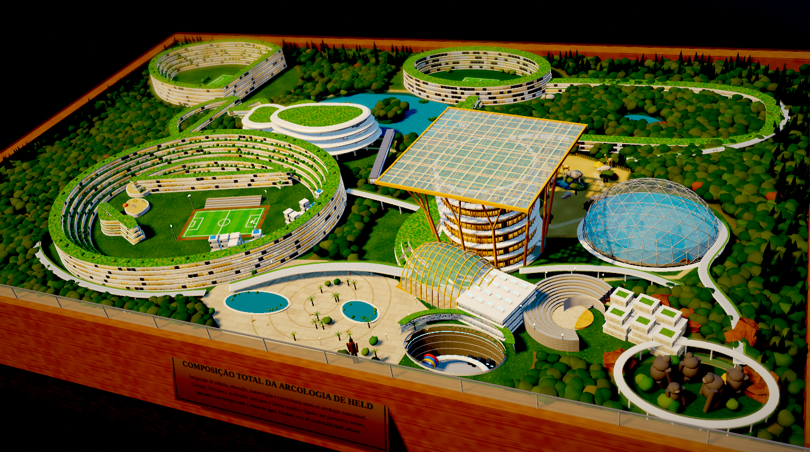
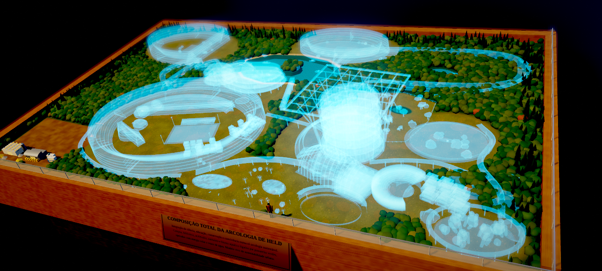
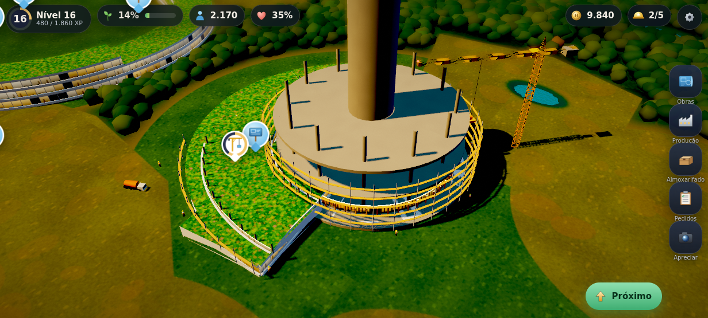
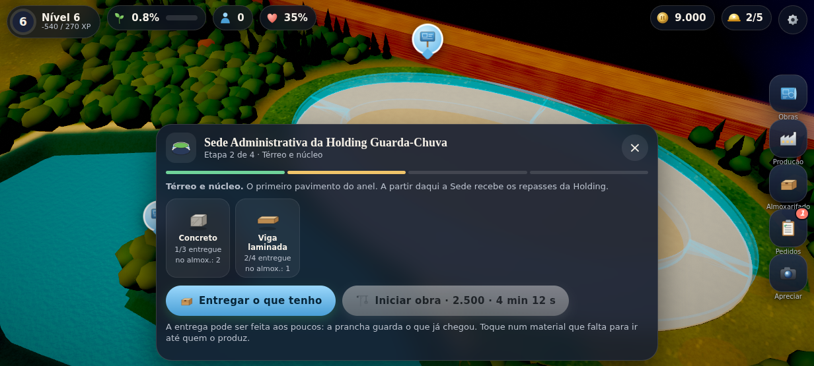
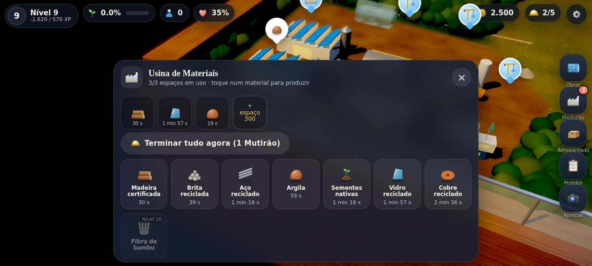
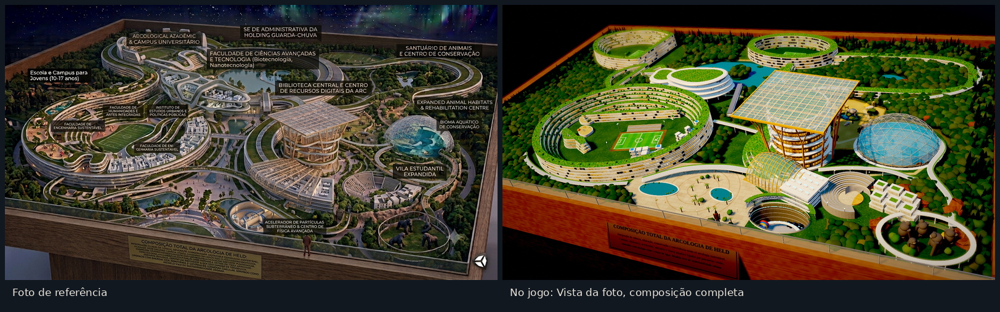
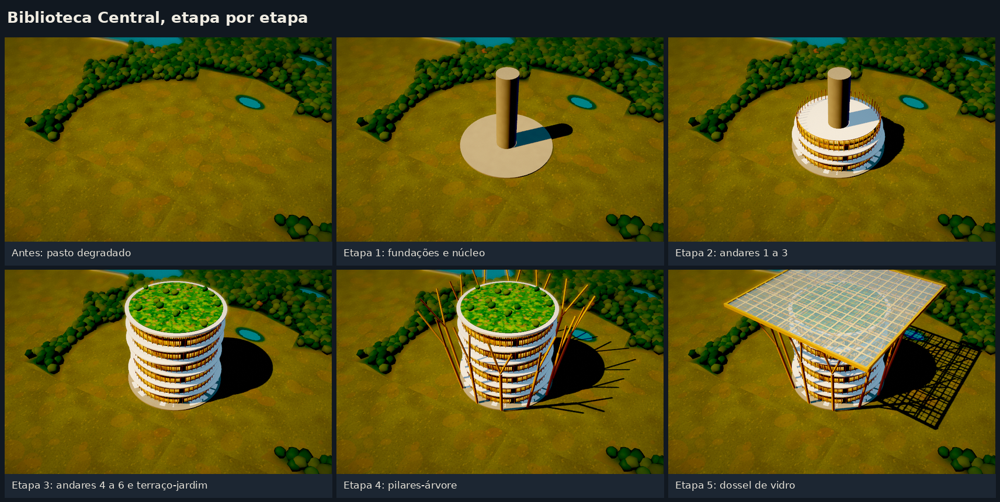

# Arcologia de Held: composição total

Jogo de construção no estilo **SimCity BuildIt**, em 3D, feito para celular (testado para o Poco X7) e que também roda no computador. A única obra do jogo é a **Composição Total da Arcologia de Held**, a maquete da foto em `arte/originais/composicao-total-arcologia-de-held.png`. Ela começa como pasto degradado cercado de mata e cresce etapa por etapa, com canteiro, andaimes, grua e operários, até ficar igual à foto.

**Jogar:** https://diogoholanda2026-cell.github.io/diogo/ (atualiza sozinho a cada envio ao GitHub).

| Composição total (Vista da foto) | Planta holográfica no início |
|---|---|
|  |  |

| Obra em andamento | Prancha de entrega | Usina de materiais |
|---|---|---|
|  |  |  |





## Instalar no celular (recomendado)

O melhor formato para este jogo é um **app instalável (PWA) servido pelo GitHub Pages**. No Poco X7:

1. Abra o link acima no **Chrome**.
2. Menu ⋮ → **Instalar app** (ou "Adicionar à tela inicial"). Se nada acontecer, dê ao Chrome a permissão **Atalhos na tela inicial** nas configurações do HyperOS.
3. Abra pelo ícone. O jogo roda em **tela cheia, em paisagem**, **funciona sem internet** e se atualiza sozinho quando houver versão nova.
4. Em Configurações do jogo, confira se aparece "Armazenamento protegido": assim o Chrome não apaga o progresso quando o celular enche.

Para jogar a **120 qps**: o Chrome para Android limita jogos a 60 qps em telas de 120 Hz. Até o Chrome 156 (que libera 120 Hz em tela cheia), desative `chrome://flags/#throttle-main-thread-to-60hz`, deixe a tela do celular em 120 Hz e escolha 120 nas configurações do jogo. 60 qps esquenta menos e gasta menos bateria.

### Por que PWA e não um app próprio (APK)

| | Navegador | **PWA instalada** | APK (Capacitor/TWA) | Motor nativo (Unity/Godot) |
|---|---|---|---|---|
| Desempenho 3D | igual | **igual** | igual (mesmo Chromium) | um pouco melhor |
| Tela cheia e paisagem travada | limitado | **sim** | sim | sim |
| Offline | não | **sim** | sim | sim |
| Atualização | automática | **automática** | reinstalar APK | reinstalar APK |
| Instalação no Poco X7 | nenhuma | **um toque** | sideload (o Google anunciou verificação obrigatória de desenvolvedores no Brasil a partir de 30/09/2026) | sideload |
| Salvamento | pode ser apagado | **protegido** (`storage.persist`) | "transitório" (WebView) | arquivo local |

A PWA usa o mesmo renderizador que um APK usaria, sem o atrito de instalar APK, e recebe cada melhoria assim que o código é enviado. Um motor nativo exigiria reescrever tudo por um ganho pequeno.

## Como jogar

O ciclo é o do SimCity BuildIt, adaptado a uma obra fixa:

1. **Usinas de Materiais** (até 3) produzem matérias-primas em paralelo: madeira certificada, brita reciclada, aço reciclado, argila, sementes nativas, vidro, cobre e fibra de bambu.
2. **Oficinas** (Carpintaria, Central de Concreto, Horto, Serralheria, Vidraçaria, Oficina Elétrica e Laboratório de Campo) transformam tudo em produtos, **um de cada vez, em fila**: vigas laminadas, concreto, lajes pré-moldadas, painéis de vidro, vidro solar, painéis de cúpula, estantes, jardins verticais, kits veterinários e outros 25 itens. "Produzir o que falta" lança a cadeia inteira de um item.
3. **Almoxarifado** tem limite. Amplie com estrados, etiquetas e cadeados, que caem ao coletar produção.
4. **Obras (marcos):** cada estrutura da foto tem de 1 a 5 etapas. Toque na placa da obra para abrir a **prancha**: entregue os materiais aos poucos, pague os créditos e inicie. A obra sobe no mapa com esqueleto de concreto, acabamento e andaimes. No fim, toque em **Aprovar**.
5. **Módulos:** os edifícios-fita em terraços (Anel do Campus, Campus Universitário, Anel da Biblioteca, Santuário e as casas da Vila) crescem **um pavimento por nível**, como as zonas residenciais do BuildIt. Cada nível pede três itens e traz moradores.
6. **Serviços:** a partir do nível 3 os moradores pedem **água** (lago), no nível 4 **energia** (fachada solar da Sede, dossel da Biblioteca, central geotérmica) e no nível 5 **saneamento** (jardins filtrantes da praça, biodigestor do santuário).
7. **Bem-estar e repasses:** escola, praça, biblioteca, bioma e outros marcos aumentam o bem-estar. A Holding repassa créditos conforme os moradores e o bem-estar; colete na Sede.
8. **Pedidos da comunidade** trocam materiais por créditos, experiência e itens especiais. O **Depósito de Trocas** compra matéria-prima e vende sobras.
9. **Mutirão:** fichas (até 5) que terminam qualquer cronômetro na hora. Ganham-se ao subir de nível, em capítulos e em pedidos.
10. **Licenças:** obras grandes pedem topografia (estacas, balizas e trenas) antes da terraplenagem.

Tudo segue rodando com o jogo fechado: ao voltar, é só coletar.

### A história e a ordem da obra

Cinco capítulos e um epílogo, com conselheiros (Íris, arquiteta-chefe; Tomé, engenheiro de materiais; Nara, bióloga; Caio, físico; Dona Cida, voz dos moradores). A ordem segue a lógica de uma obra real: primeiro o acesso, a água e a administração; depois moradia, escola e praça; em seguida biblioteca e faculdades; o acelerador subterrâneo e a vila; por fim os habitats dos animais. Cada capítulo termina com uma apresentação ao Conselho da Holding e uma escolha de incentivo.

1. **Fundação:** canteiro, Caminho da Frente, desassoreamento do Lago Central, Sede da Holding e os primeiros módulos do Anel.
2. **Água que corre:** margens vivas e estação natural de água, Escola e Campus para Jovens, campo, Praça Central com jardins filtrantes, Bulevar Verde, anel de vidro solar da Sede.
3. **Saber de madeira:** Biblioteca Central (núcleo, andares, pilares-árvore, dossel), Centro de Recursos Digitais, Faculdades de Humanidades, Engenharia e Ciências, Instituto de Estudos Urbanos, Campus Universitário, Ala em Onda, pontes.
4. **Energia escondida:** Acelerador de Partículas (poço, anel, detectores, Centro de Física), anfiteatro e casas da Vila Estudantil.
5. **Casa dos gigantes:** Santuário, habitats da savana com elefantes, girafas e rinocerontes, Bioma Aquático (cúpula geodésica com aquário) e Recinto dos Gorilas.
6. **Composição total:** as oficinas descem para galpões sob o acelerador e o canteiro vira mata. A maquete fica igual à foto.

Um robô de teste (`ferramentas/simular.mjs`) joga do início ao fim e confirma que não existe trava. Jogando algumas vezes por dia, a composição inteira leva de uma a duas semanas; em Configurações, **Ritmo da obra 2× ou 4×** encurta todos os cronômetros.

## Controles

- **Um dedo:** arrasta o mapa (com inércia). **Pinça:** aproxima. **Torcer dois dedos:** gira. **Dois dedos para cima/baixo:** inclina.
- **Toque** numa construção, num lote ou num balão. **Toque duplo:** aproxima naquele ponto. Arrastar o dedo por vários balões de coleta recolhe todos.
- **Próximo:** leva até a próxima coisa a fazer.
- **Apreciar:** esconde a interface. A barra de baixo tem **Foto** (volta ao enquadramento exato da foto), um **controle deslizante** que põe a foto por cima da maquete com transparência ajustável, **Rótulos** da maquete, **Planta** holográfica e **Luz** (exposição, noite ou dia).
- No computador: arrastar move, roda do mouse aproxima, botão direito gira e inclina.

## Gráficos

Feitos para o Mali-G615 MC2 do Poco X7, com resolução que se ajusta sozinha para manter a fluidez:

- Obras com esqueleto de concreto, plano de corte com borda incandescente, andaimes que sobem junto e contornam o prédio, grua, betoneira e operários.
- Renderização em alta faixa dinâmica com MSAA 4×, **bloom** com filtro de Karis, **profundidade de campo de maquete** (tilt-shift), tonemapping ACES, gradação de cor, vinheta e pontilhado.
- Sombras suaves que só são recalculadas quando algo muda; reflexos de uma "sala de exposição"; céu noturno com **aurora**.
- Fachadas com luz interna, terraços verdes, floresta instanciada com vento, água com normal animada.
- Tudo o que fica pronto é **fundido em poucas malhas por material** (cerca de 150 chamadas de desenho com a composição inteira, contando sombras).
- Perfis **Ultra, Alta, Média e Leve**, escolhidos automaticamente pelo processador gráfico; limite de 30, 60 ou 120 qps; 30 qps quando a tela fica parada.

## Estrutura do código

```
app/                         o jogo montado (PWA publicada no GitHub Pages)
arcologia-de-held.html       o mesmo jogo num arquivo único (abre direto, sem servidor)
arte/originais/              imagens de referência (a foto da composição total)
arte/telas/                  capturas de tela
fonte/
  main.js                    carregamento, motor, mundo, save, primeiro toque
  jogo.js                    liga simulação, mundo 3D e interface
  core/                      utilidades, som procedural, vibração, salvamento (IndexedDB)
  data/                      planta traçada da foto, itens, obras e etapas, história, rótulos
  sim/estado.js              simulação: produção, filas, prancha, módulos, serviços, capítulos
  render/                    motor (pós-processamento), câmera, céu, terreno, floresta, mesa,
                             canteiro animado, figuras, animais e o mundo
  render/models/             cada estrutura da foto, por etapas
  ui/                        HUD, painéis, balões, ícones desenhados em código, configurações
  web/                       HTML, manifesto, service worker, ícones e a foto em WebP
ferramentas/
  montar.mjs                 empacota fonte/ com esbuild em app/ e no arquivo único
  simular.mjs                robô que joga do início ao fim (equilíbrio da economia)
  testar.mjs                 capturas de tela no Chromium (WebGL por software)
```

```bash
npm install
npm run montar            # gera app/ e arcologia-de-held.html
node ferramentas/simular.mjs 30 1   # robô: verifica cada 30 min, ritmo 1×
npm run testar -- /tmp/tela.png "vista=foto&tudo=1"
```

Three.js (licença MIT) vai embutido no pacote; o aviso de licença fica no fim de `app/jogo.js`.
