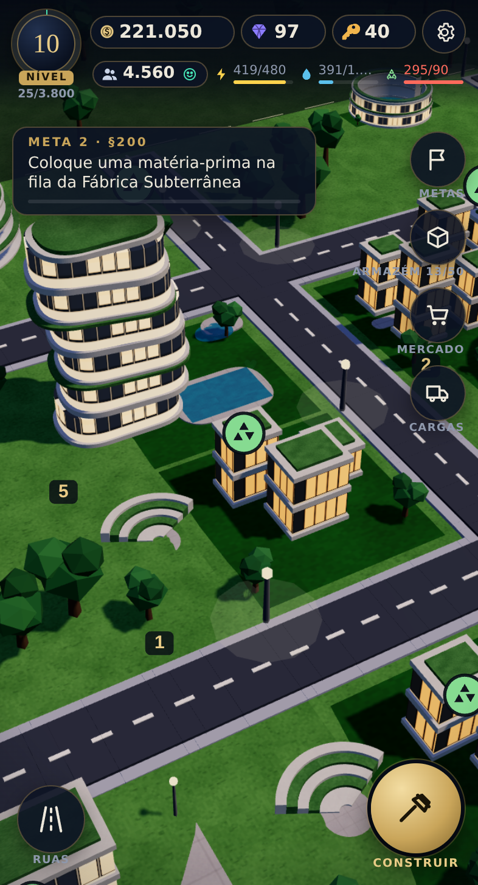
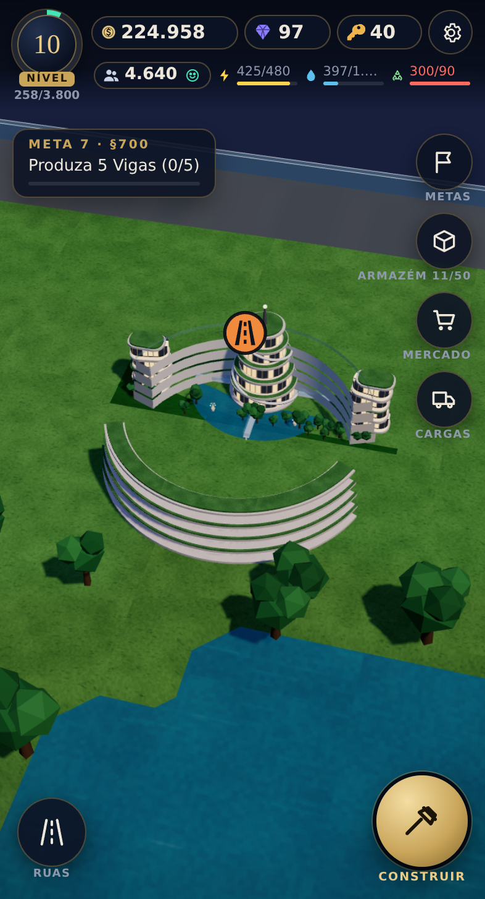
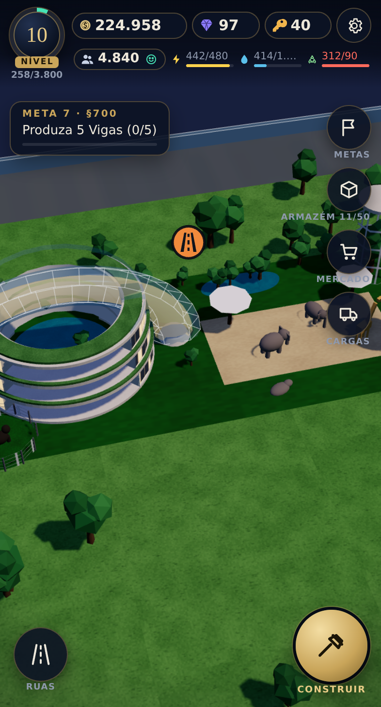
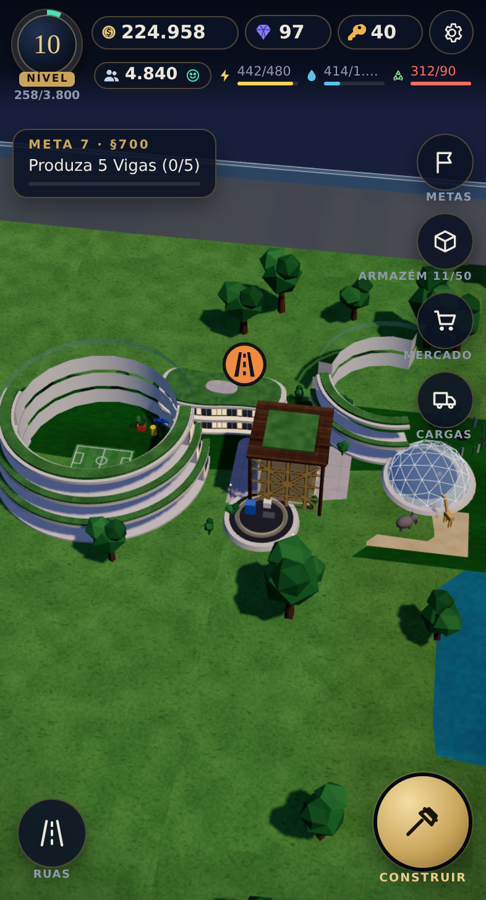
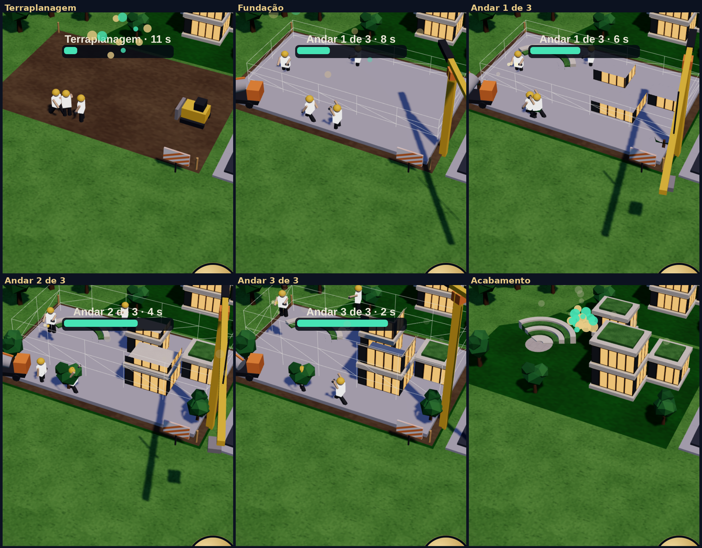

# Arcologia de Held — maquete viva

Jogo de construção de cidade **em 3D** para celular (e navegador de computador), com a **mecânica do SimCity BuildIt** e as construções da **Arcologia de Held** modeladas em 3D a partir das seis maquetes de referência em `arte/originais`.

**Jogar online:** https://diogoholanda2026-cell.github.io/diogo/ (publicado pelo GitHub Pages a cada push).

Ou abra `arcologia-de-held.html` em qualquer navegador com WebGL: é um único arquivo, funciona offline, salva sozinho no aparelho e continua rendendo enquanto você está fora.

| Início | Cidade crescendo | De perto |
|---|---|---|
|  |  |  |

| Arcologia Circular (Modelo-01) | Santuário Expandido | Arcologia de Held |
|---|---|---|
|  |  |  |

## Câmera e controles

Como no BuildIt: **um dedo** arrasta o mapa; **dois dedos** aproximam (pinça), **giram** (torcendo) e **inclinam** (subindo ou descendo os dois dedos). No computador: arrastar move, roda do mouse aproxima, **botão direito** gira e inclina, `Q`/`E` giram, `+`/`-` aproximam, `Esc` fecha o que estiver aberto. Toque numa construção para abrir a ficha (melhorar, produzir, mover, demolir).

## Como o jogo funciona (o mesmo ciclo do SimCity BuildIt)

1. **Ruas.** Toda construção precisa encostar numa rua ligada à rodovia que entra pela esquerda. Ruas têm três níveis (rua, avenida, via expressa); trechos com muitas construções ficam congestionados e derrubam a felicidade. A **Estação Transit** amplia a capacidade das ruas em volta.
2. **Zonas Residenciais.** Cada zona começa como *Vila Estudantil* e evolui por **7 estágios**, cada um com um modelo 3D diferente (blocos brancos → terraços do anel → curvas de vidro → torre espiral → anel residencial). Para melhorar, a moradia **pede itens**; ao entregar, você ganha créditos, XP e mais habitantes.
3. **Fábricas** produzem matérias-primas numa fila sequencial. **Lojas** transformam matérias-primas em produtos. Itens prontos aparecem numa bolha sobre a construção: toque para coletar. O **armazém** tem limite; amplia-se com créditos e peças.
4. **Serviços.** Energia, água e reciclagem têm capacidade (barras no topo). Segurança, saúde e educação cobrem um raio. Parques e santuários dão felicidade.
5. **Felicidade e impostos.** A felicidade de cada moradia depende dos serviços, do trânsito e dos parques por perto. Os impostos acumulam na **Sede da Holding** (até 6 h): toque na moeda para coletar.
6. **Comércio.** *Depósito comercial* (no Armazém) vende itens em minutos; a **Torre do Comércio Global** abre o *Mercado Global* com ofertas de outras cidades.
7. **Terminal de Cargas.** Encomendas pedem itens; despache o comboio para ganhar **chaves** (parques grandes e marcos) e **peças de expansão** (terreno e armazém).
8. **Pedidos dos moradores**, **cristais** (compram itens que faltam e aceleram filas; ganhos por nível e metas, sem loja) e **marcos**: Arco da Holding, Arcologia Circular, Ciência e Educação, Santuário Expandido, Holding e Santuário Global e a composição total **Arcologia de Held**.

## A obra, passo a passo



Cada construção nova passa por fases visíveis, com **operários** e máquinas em 3D: terraplanagem (trator empurrando terra, operários de pá) → fundação (laje crescendo, betoneira com tambor girando) → estrutura **andar por andar** (esqueleto de aço, depois o andar concreto sobe por um plano de corte) com andaime de postes e travessas, guindaste girando e içando painéis, operários andando, carregando, martelando e soldando (com faíscas) → acabamento (andaime e guindaste somem, confete). Melhorias de moradia reconstroem o novo estágio por cima do antigo com o mesmo canteiro.

## Como as construções são feitas

Não há modelos importados: cada construção é **gerada por código** (`codigo-fonte/js/05c-modelos.js`) a partir de peças paramétricas inspiradas nas maquetes: anéis e arcos brancos com terraços verdes e faixas de vidro iluminado, torres curvas de vidro, torre em degraus com rampa em espiral, cúpulas geodésicas, telhados-flor solares, torre bioclimática com cobertura em pétalas, biblioteca em treliça de madeira, laboratórios em corte, lagos com fontes, campos, anfiteatro, recintos com gorilas, hipopótamos, elefantes e girafas, aviário de tela, viadutos e pontes. As fotos das maquetes continuam nas fichas e no menu como referência.

## Estrutura do código

```
arcologia-de-held.html          jogo montado (único arquivo, abre direto)
arte/originais/                 as seis imagens da Arcologia de Held
arte/telas/                     capturas de tela
codigo-fonte/
  estilo-e-cabecalho.html       CSS e <head>
  estrutura.html                HTML da interface e ícones SVG
  imagens.js                    recortes das maquetes (fichas e menu), gerado
  lib/three.min.js              Three.js r158 (licença MIT em lib/LICENSE-three.txt)
  js/01-base.js                 constantes e utilidades
  js/02-dados.js                itens, receitas, construções, níveis, metas
  js/03-mundo.js                terreno, ruas, trânsito, estado e recálculo
  js/04-simulacao.js            produção, melhorias, impostos, mercado, cargas, tempo offline
  js/05a-materiais.js           texturas procedurais, materiais e utilidades de geometria
  js/05b-cena.js                renderizador, câmera orbital, céu, mesa, terreno, ruas, árvores, carros
  js/05c-modelos.js             geradores 3D de todas as construções
  js/05d-obra.js                canteiro de obras: operários, máquinas, andaime, plano de corte
  js/05e-quadro.js              sincronização estado→cena, seleção, fantasma, overlay 2D
  js/06-entrada.js              toque, mouse, câmera, posicionar e traçar ruas
  js/07-interface.js            HUD, menu de construção, fichas e painéis
  js/08-salvar.js               salvamento local e na nuvem (quando disponível)
  js/09-inicio.js               laço principal e boot
  ferramentas/preparar-imagens.py   recorta as maquetes e gera imagens.js
  ferramentas/montar.py             junta tudo em arcologia-de-held.html
  ferramentas/testar.js             teste de fumaça com Playwright (WebGL por software)
```

### Montar depois de mudar algo

```bash
pip install pillow                                              # só para os recortes
python3 codigo-fonte/ferramentas/preparar-imagens.py --folha    # gera imagens.js (+ folha de contato)
python3 codigo-fonte/ferramentas/montar.py                      # gera arcologia-de-held.html
```

Para mudar um modelo 3D, edite a função correspondente em `MODEL` (`js/05c-modelos.js`): cada uma devolve um `Group` com o chão em y = 0 e a origem no centro do lote; o jogo encaixa o modelo no lote automaticamente.

### Teste automático

```bash
npm install playwright
node codigo-fonte/ferramentas/testar.js
```

O teste abre o jogo num celular simulado com WebGL por software, exercita construção, produção, melhoria, ruas, mercado, terminal, expansão e salvamento, e lista qualquer erro de execução.

### Desempenho

O painel da cidade (engrenagem) tem a opção **Gráficos: Leve**, que desliga as sombras e reduz a resolução para aparelhos mais fracos. A cena usa malhas mescladas por material, árvores e carros instanciados e sombras em mapa único.
