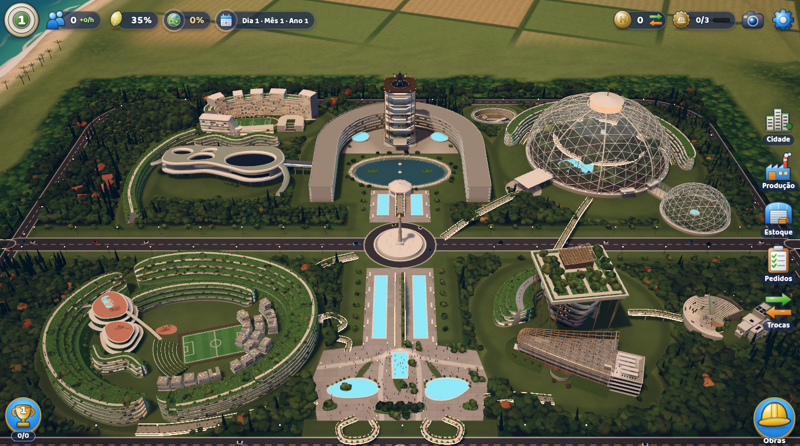
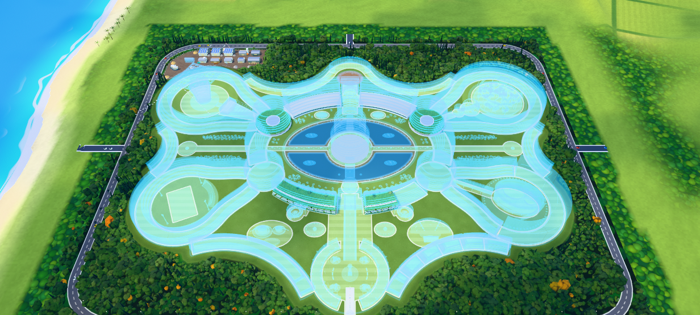
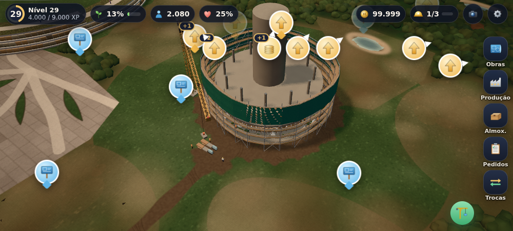
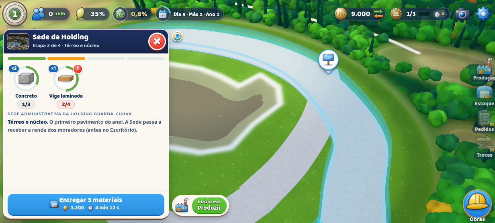
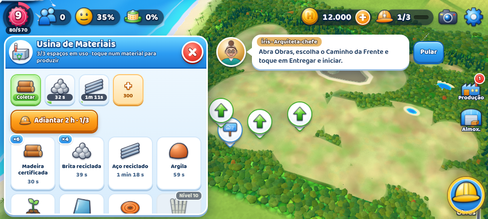
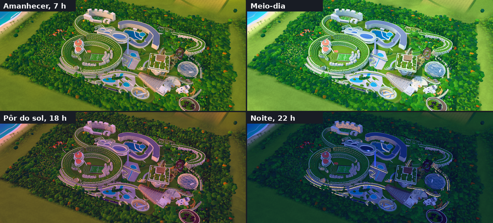
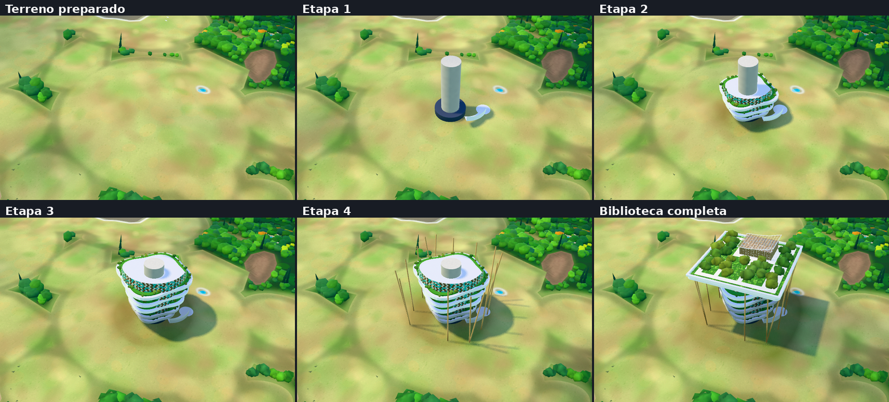
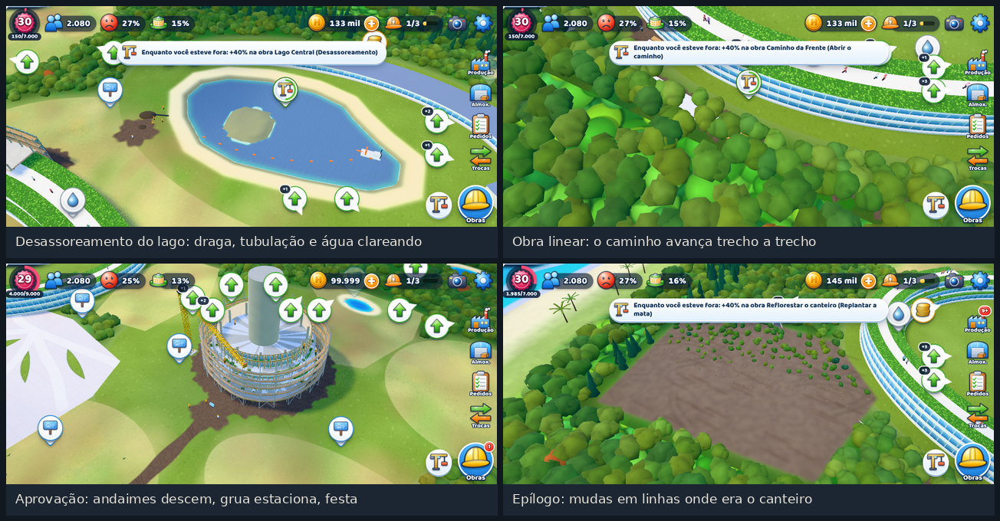

# Arcologia de Held: composição total

Jogo de construção no estilo **SimCity BuildIt**, em 3D, feito para celular (testado para o Poco X7) e que também roda no computador. A obra central do jogo é a **Arcologia de Held**, uma cidade-parque organizada por um **plano diretor** (eixo e quadras) com os tipos de estrutura da foto de referência em `arte/originais/composicao-total-arcologia-de-held.png` (arena em grelha com torres, colinas de terraços verdes, fitas de varandas brancas, rede de bandas com vidraçaria espelhada, torre em vaso com jardim na cobertura, cúpula geodésica), sem copiar a disposição da foto. Tudo num **mundo aberto**, com praia, mar, campos e morros em volta, onde o jogador constrói a **cidade** que tem a Arcologia como centro, com a luz quente de exposição, janelas acesas e céu azul-marinho com aurora. Ela começa como pasto degradado cercado de mata e cresce etapa por etapa, com canteiro, andaimes, grua e operários.

**Jogar:** https://diogoholanda2026-cell.github.io/diogo/ (atualiza sozinho a cada envio ao GitHub).

**Visão e roteiro:** [`docs/VISAO.md`](docs/VISAO.md) traz as referências (Cities: Skylines II e Highrise City), a avaliação de plataforma (navegador, app de PC e Android), a Holding com decisões, rivais e aliados, as 12 metrópoles e as fases seguintes. Agentes e receitas para o Claude ficam em `CLAUDE.md` e `.claude/`.

| Composição total, de dia | Planta holográfica no início |
|---|---|
|  |  |

| Obra em andamento | Prancha de entrega | Usina de materiais |
|---|---|---|
|  |  |  |







## Jogo novo: Prévia 2, M1a jogável

O jogo está sendo refeito do zero (three.js r186 em WebGL2 e Preact), no nível do Cities: Skylines II, com a Holding Held, Heldópolis e o Park of Future Dreams. Até a publicação do M1, o link acima continua com o jogo anterior; o novo fica na prévia, **https://diogoholanda2026-cell.github.io/diogo/previa/cenas.html**, que abre em destaque a Prévia 2: a Nova partida (jan. 2020), a sede v3 (aérea, avenida, mar e noite), a obra da Blade Tower e da Legacy Tower com a Dream Bridge e o helicóptero, os prédios colocáveis, a rua com gente e caminhões, as camadas e o Teste de desempenho. O documento que manda é [`docs/PROJETO.md`](docs/PROJETO.md).

Medido em 03/10/2026 no Chromium de teste (WebGL por software), na bancada `aberta` (a cidade sintética de 12 mil prédios), 1376 x 768, pior quadro de 120 com o sol andando em 4x, antes e depois do fechamento da onda 3:

| Perfil | Chamadas | Triângulos | Sombra (chamadas / triângulos) | Vídeo | Compilações depois de pronto |
|---|---|---|---|---|---|
| PC do dono | 73 para 73 | 643 mil para 644 mil | 14 / 269 mil para 14 / 270 mil | 331 MB | 7 para 0 |
| Média | 63 para 62 | 271 mil para 271 mil | 7 / 54 mil | 168 MB | 0 para 0 |

Os tetos são 800 chamadas e 2,5 milhões de triângulos no PC (D66) e 300 e 900 mil no Média. As 7 compilações depois de pronto (árvores, gente, caminhão, marcador e o prédio de perto) vinham de código que chega sob demanda depois da rodada final do aquecimento; agora a rodada final espera esse código. Nenhum programa deixa de ligar (os dois "ShaderMaterial" que a bancada acusava eram os geradores das folhas e dos impostores, já descartados quando ela olhava). JS principal de 2.045 KB (teto de 2.355 KB, D91), mais 395 KB sob demanda em 51 pedaços; worker da oficina com 225 KB. O tempo de placa por passe no software não vale para o PC do dono: o número de verdade sai do Teste de desempenho (Configurações) ou da página de teste no PC dele.

## Instalar no celular (recomendado)

O melhor formato para este jogo é um **app instalável (PWA) servido pelo GitHub Pages**. No Poco X7:

1. Abra o link acima no **Chrome**.
2. Menu ⋮ → **Instalar app** (ou "Adicionar à tela inicial"). Se nada acontecer, dê ao Chrome a permissão **Atalhos na tela inicial** nas configurações do HyperOS.
3. Abra pelo ícone. O jogo roda em **tela cheia, em paisagem**, **funciona sem internet** e se atualiza sozinho quando houver versão nova.
4. Em Configurações do jogo, confira se aparece "Armazenamento protegido": assim o Chrome não apaga o progresso quando o celular enche.

Para jogar a **120 qps**: o Chrome para Android limita jogos a 60 qps em telas de 120 Hz. Até o Chrome 156 (que libera 120 Hz em tela cheia), desative `chrome://flags/#throttle-main-thread-to-60hz`, deixe a tela do celular em 120 Hz e escolha 120 nas configurações do jogo. 60 qps esquenta menos e gasta menos bateria.

### Por que PWA e não um app próprio (APK)

| | Navegador | **PWA instalada** | APK (Capacitor/TWA) | Motor nativo (Unity/Godot) |
|---|---|---|---|---|
| Desempenho 3D | igual | **igual** | igual (mesmo Chromium) | um pouco melhor |
| Tela cheia e paisagem travada | limitado | **sim** | sim | sim |
| Offline | não | **sim** | sim | sim |
| Atualização | automática | **automática** | reinstalar APK | reinstalar APK |
| Instalação no Poco X7 | nenhuma | **um toque** | sideload (o Google anunciou verificação obrigatória de desenvolvedores no Brasil a partir de 30/09/2026) | sideload |
| Salvamento | pode ser apagado | **protegido** (`storage.persist`) | "transitório" (WebView) | arquivo local |

A PWA usa o mesmo renderizador que um APK usaria, sem o atrito de instalar APK, e recebe cada melhoria assim que o código é enviado. Um motor nativo exigiria reescrever tudo por um ganho pequeno.

## Como jogar

O ciclo é o do SimCity BuildIt, adaptado a uma obra fixa e pensado para **4 visitas curtas por dia**: em cada visita o jogador enche as filas em lotes, entrega, aprova e decide o que acelerar; o canteiro trabalha e a produção entra sozinha no Almoxarifado enquanto o jogo está fechado.

1. **Calendário:** um dia do jogo dura **20 segundos** reais (mês de 30 dias, ano de 360 dias = 2 horas), contado pelo relógio real desde a criação do jogo, inclusive fechado. O calendário pequeno do HUD mostra dia, mês e ano.
2. **Usinas de Materiais** (a primeira e a terceira, com até 6 espaços) produzem matérias-primas em paralelo: madeira certificada, brita reciclada, aço reciclado, argila, sementes nativas, vidro, cobre e fibra de bambu. Cada espaço faz um **lote de 1 a 10** (escolhido com + e −); 10 unidades levam 8 vezes o tempo de 1. Um espaço marcado como **automático** recomeça o mesmo lote assim que o anterior é coletado.
3. **Oficinas** (Carpintaria, Central de Concreto, Horto, Serralheria, Vidraçaria, Oficina Elétrica e Laboratório de Campo) fazem os produtos em **fila de até 9 trabalhos, um de cada vez**, e cada trabalho também é um lote de 1 a 10, limitado pelo que há de insumo no Almoxarifado (os insumos saem na hora). Quanto mais avançado o produto, mais tempo leva (níveis 1–2 ×0,75, 3–4 ×1, 5–9 ×3, 10–14 ×5, 15+ ×8): uma fila cheia rende a noite inteira. A oficina também tem modo automático: repete o item escolhido, em lotes, enquanto houver insumos e vaga. **Encomenda em cadeia:** uma unidade pode entrar na fila sem os insumos; ela espera, puxa os insumos quando ficam prontos, nunca segura a fila e sai sozinha depois de 12 h sem insumos.
4. **Coleta automática:** todo lote pronto vai direto para o **Almoxarifado** (120 vagas no começo, +40 por ampliação com estrados, etiquetas e cadeados, que caem ao coletar produção e ao subir de nível). Se ele lotar, o resto espera no espaço ou na bandeja da oficina (com a bandeja cheia, 9 itens, a fila para) até você coletar.
5. **Obras:** cada estrutura da foto tem de 1 a 5 etapas. Na **prancha**, entregue os materiais aos poucos, pague os créditos e inicie. As obras ficam mais longas a cada capítulo (de minutos no capítulo 1 a horas no 5). Ao aprovar, a Holding paga a **recompensa: 150% do que a etapa custou** (créditos pagos mais o valor dos itens entregues) e dá **2 aceleradores**, um de obra e um de produção; cada acelerador adianta **1 hora** de uma obra ou pavimento em andamento, de todos os espaços de uma usina ou do trabalho da frente de uma oficina. Também dá para **comprar tempo** com créditos nos painéis de obra, pavimento, usina e oficina: **1 minuto por 100, 5 minutos por 500, 10 por 1.000, 30 por 2.500 e 1 hora por 5.000**; o cronômetro adianta na hora.
6. **Módulos:** os edifícios-fita (Anel do Campus, Campus Universitário, Anel da Biblioteca, Santuário com 4 pavimentos e as casas da Vila) crescem um pavimento por nível; cada pavimento aprovado também devolve 150% do que custou.
7. **Serviços e bem-estar:** do nível 3 em diante os moradores pedem **água**; do 4 em diante, **energia e saneamento**; o último pavimento pede **70% de bem-estar**. O bem-estar é 35 + as obras de lazer + as escolhas do Conselho − 1 ponto a cada 200 moradores: morar mais gente pede mais praça, escola e verde. No fim do capítulo 3 fica em torno de 77% (cerca de 82% com as escolhas que cuidam das pessoas, 67% com as que aceleram a obra); por isso, no capítulo 4, quem escolheu acelerar precisa do palco do anfiteatro e do Centro de Física antes de subir o Anel ao 5º pavimento.
8. **Renda dos moradores:** cada morador paga, **por hora real**, 5 créditos com bem-estar geral até 30%, 8 de 31% a 60% e 11 de 61% a 100% (1.500 moradores na faixa de até 30% rendem 7.500 por hora). O cofre da Sede (antes dela, do Escritório) guarda até **12 horas** de renda; com o jogo fechado rendem no máximo 12 horas, pela metade.
9. **Escritório e finanças:** o **valuation** da construção sobe sozinho conforme ela avança (etapas e pavimentos a 150% do que custaram, prédios e ampliações pelo preço, 100 por morador e o caixa, que é os créditos menos a dívida), com o recorde guardado. O **empréstimo** dá até **50 mil por ano do jogo**, em passos de 1.000, com dívida total (principal mais juros devidos) de até **500 mil**, juros de **10% ao ano** sobre o principal e prazo de **10 anos** por contrato; depois do prazo o saldo rende mora de 20%. Dá para pagar só os juros (e ficar devendo o principal), pagar juros + uma parcela de 10% do principal (mínimo 1.000, abatendo os contratos mais antigos) ou quitar tudo.
10. **Mutirão e disposição:** a comunidade ganha **disposição** (+2 por pedido, +4 por módulo, +8 por etapa, +30 por marco); a cada 100 pontos vem uma **ficha de Mutirão** (teto de 3). Uma ficha adianta até **2 horas** de um cronômetro (na usina, todos os espaços; na oficina, o item atual).
11. **Licenças:** obras grandes pedem topografia. **Estacas** vêm da madeira (0,6%), **balizas** da Serralheria (3%) e **trenas** da Oficina Elétrica (3%). O **Topógrafo** do Escritório faz uma por vez: estaca (2 madeira + 300, 20 min), baliza (2 aço + 600, 30 min), trena (2 cobre + 900, 45 min).
12. **Pedidos da comunidade** (do capítulo 2 em diante: 3 cartões, 4 no capítulo 3, 6 depois) têm quem pede, onde mora e por quê. Pedem **5 vezes mais** itens do que antes (10 a 25 matérias-primas, 5 ou 10 produtos por tipo) e pagam **150% do valor** dos itens em créditos, além de experiência e licenças, itens de almoxarifado, bem-estar por 24 h ou disposição. O quadro mostra o total de cada item somando todos os pedidos. A **Usina de Pedidos da Comunidade** (a antiga Usina de Materiais II, no nível 7) só fabrica o que está nos pedidos: toque em "Fabricar" num pedido e os três espaços dela produzem em paralelo o que falta (matéria-prima e produtos, usando os insumos do Almoxarifado), com coleta automática.
13. **Depósito de Trocas:** 10 unidades de cada matéria-prima a cada 4 horas, com o preço subindo 12% a cada compra; **vende por 150% do preço base de compra** (4,5 × o valor do item), até **100 vendas** por janela de 4 horas.

Tudo segue rodando com o jogo fechado: ao voltar, usinas e oficinas andam em passos de 5 minutos (uma pode esperar o produto da outra, e o automático continua até lotar o Almoxarifado), os juros do empréstimo e o calendário contam o tempo real. Jogando quatro vezes por dia, a composição inteira leva de uma a duas semanas; em Configurações, **Ritmo da obra 2× ou 4×** encurta todos os cronômetros.

### A história e a ordem da obra

Cinco capítulos e um epílogo, com conselheiros (Íris, arquiteta-chefe; Tomé, engenheiro de materiais; Nara, bióloga; Caio, físico; Dona Cida, voz dos moradores). A ordem segue a lógica de uma obra real: primeiro o acesso, a água e a administração; depois moradia, escola e praça; em seguida biblioteca e faculdades; o acelerador subterrâneo e a vila; por fim os habitats dos animais. Cada etapa aprovada tem uma fala do conselheiro da área; ao cumprir 1/3 e 2/3 das metas de um capítulo vem um **marco** (fala, disposição e créditos).

No fim de cada capítulo o Conselho apresenta um **dilema** sobre o que vem pela frente: a primeira opção cuida das pessoas (bem-estar), a segunda acelera a obra, e cada uma tem um custo. Canteiro compacto × amplo; Biblioteca aberta dia e noite × Laboratórios primeiro; Telhados solares × Geotermia profunda; Elefantes × Cúpula primeiro; e, para o replantio do epílogo, Tarifa social da água (+6% de bem-estar, replantio 30% mais caro) × Água para a obra (Horto 20% mais rápido e replantio 40% mais curto, −3% de bem-estar). O epílogo lembra as escolhas.

1. **Fundação:** canteiro, Caminho da Frente, desassoreamento do Lago da Sede, Sede da Holding e os primeiros módulos do Anel. Um tutorial curto (4 a 6 minutos) leva da primeira brita ao primeiro módulo: um anel dourado pulsa sobre o que tocar (o balão, o botão ou o controle dentro do painel) e o conselheiro explica cada passo.
2. **Água que corre:** o Anel fecha em volta do lago com os tambores e o portal, as 4 bacias com diques e canais, a folha da Escola com o campo, a Praça da Entrada com a colunata, as fontes e o Marco, o Bulevar Verde e o vidro solar da Sede.
3. **Saber de madeira:** a Torre da Holding na ilha, a Biblioteca Central e o CRD, a folha da Universidade (Engenharia, Campus Universitário, Instituto, Ciências), Humanidades, Ala em Onda, Elo Norte e as pontes.
4. **Energia escondida:** Acelerador de Partículas (poço, linha de luz, detectores, Centro de Física em crescente), anfiteatro e as casas da Vila, que espelham a Humanidades.
5. **Casa dos gigantes:** a **Cúpula da Vida**, uma cúpula de vidro fechada com mata tropical, lago, riacho, rochedo com cascata e névoa por dentro (a fauna resgatada vive escondida na mata), a estufa anexa ligada por um tubo de vidro, a galeria de entrada com a passarela nas copas e o Santuário, fita residencial de 4 pavimentos em arco que abraça a cúpula. Os materiais da cúpula (nós, painéis, acrílico, ração, kits veterinários) só aparecem aqui.
6. **Composição total:** desmontar o canteiro (as oficinas descem para galpões sob o acelerador) e replantar a mata. As duas pranchas aceitam materiais já no capítulo 5 e as obras do epílogo são curtas de propósito (fator de obra 0,15), então o final acontece em uma ou duas visitas, como uma festa.

### O plano diretor da Arcologia: o Trevo da Holding

A Arcologia é **uma construção só**: um trevo de quatro folhas em volta de um anel, feito das fitas de terraços da
foto de referência e das imagens originais do dono (a arcologia circular com a torre escalonada no lago, a Sede ao pôr
do sol e os anéis ligados por fitas). Ocupa 80 x 62 unidades entre a praia, o porto e os bairros; a mata fica só como
moldura escura em volta.

- **Anel Mestre:** a **Sede da Holding** (8 pavimentos de varandas brancas, com pórtico dourado sobre o portal norte) e
  o **Anel** de moradia (7 pavimentos de terraços verdes descendo para o lago) abraçam o **Lago da Sede**, dividido em 4
  bacias por diques-jardim. No centro, na ilha, a **Torre da Holding**, um bolo de noiva de 4 camadas creme e âmbar com
  terraços-jardim, coroa de vidro e **heliponto** a 14 de altura, o único pico. O **helicóptero da Holding** mora ali.
- **Quatro tambores** (rotundas de vidro âmbar e lanterna no átrio) nos nós diagonais sobem junto com o módulo da fita
  a que pertencem. De cada um sai uma **folha em gota** que abraça um miolo: **Escola** a sudoeste (campo com
  arquibancada e torres de luz), **Universidade** a sudeste (Engenharia, Campus Universitário com 5 torres, Instituto e
  a Faculdade de Ciências no miolo, com pista e Ponte Coberta), **Biblioteca** a noroeste (torre-vaso sobre espelho
  d'água e o CRD em leque) e **Vida** a nordeste (a **Cúpula da Vida** fechada, a Estufa encostada e a Galeria em fila).
- **Contorno fechado:** a Ala em Onda e o Elo Norte nos vales (com canais e repuxos), Humanidades e Vila como braços que
  abraçam a praça, e o Elo do Santuário, que continua no crescente do **Centro de Física** ao norte. Uma **linha de luz**
  azul (o acelerador) corre rente ao pé do contorno e acende à noite.
- **Eixo x = 0:** portão, Caminho da Frente, **Praça da Entrada** redonda com a colunata, o espelho e o **Marco da
  Holding**, a esplanada com duas fontes, o Bulevar Verde sob o portal do Anel, o pavilhão guarda-chuva, a ponte, a ilha
  e a Torre, a ponte privada, o portal da Sede e o poço do acelerador.
- **Carro só por fora:** o anel viário contorna tudo, com quatro **saídas** para o Bairro Sul, o Bairro Norte, o Bairro
  Leste e o porto. O pátio de obras fica no canto noroeste, fora da figura.
- **Desde o capítulo 1** a figura inteira aparece no chão como grama aparada (o gabarito), e cada capítulo fecha partes
  do trevo. `ferramentas/teste-planta.mjs` confere a regra das juntas na planta e `ferramentas/conexoes.mjs` na
  geometria de verdade.

### A cidade em volta da Arcologia

A Arcologia é o centro de uma cidade que o jogador constrói no mundo aberto em volta dela, além da faixa de mata:

- **Vinte bairros de lotes** de 4 x 4 (1.651 lotes) em volta da Arcologia. O **Bairro Sul** (133 lotes) abre de graça; os outros se compram quando o capítulo chega, cada vez mais longe e mais caros: Leste (25 mil, capítulo 2), Norte (60 mil) e Sudeste (90 mil) no 3, Nordeste (140 mil) e Leste Alto (200 mil) no 4, Enseada e Serra (240 mil) no 5, Sul Novo (320 mil), Norte Novo (400 mil) e o anel externo de dez bairros (450 mil a 800 mil) no 6. Cada tipo de prédio pode ter até 27.000 unidades.
- **Desmate:** os lotes começam cobertos de mata, com o chão escuro de folhas. Comprar um bairro abre só a avenida em volta. **Dois toques nas árvores** de um lote desmatam (metade do preço base do terreno: 200 no Sul) e dão 3 de madeira: as árvores tombam, sobe poeira, ficam toras no chão, e a rua, a calçada e o gramado aparecem em volta do lote. A mata sai pela borda do bairro ou ao lado de um lote já limpo (a rua avança lote a lote). No modo de colocar, os lotes com mata aparecem em marrom e são desmatados junto com a construção.
- **Botão Cidade** na coluna da direita: o catálogo por categoria mostra o que cada prédio dá, o custo e o tempo. Ao escolher, os lotes livres ficam azuis e a câmera vai ao bairro; um toque num lote constrói, e a obra do nível 1 começa na hora, com as mesmas animações das obras da Arcologia (cerca, caminhão, operários, grua nos prédios altos, aprovação com festa). Construir só pede créditos, como pôr uma zona no BuildIt.
- **Moradia** sobe de nível como os módulos do Anel, com materiais, serviços e bem-estar: **Casas com jardim** (3 níveis, até 240 moradores), **Edifício em terraços** (5 níveis, até 1.260, a partir do capítulo 2) e **Torre-jardim** (5 níveis, até 2.800, a partir do capítulo 3). Cada nível acrescenta pavimentos com terraços, canteiros e árvores.
- **Comércio** aumenta a renda de todos os moradores: **Rua comercial** (3 níveis, +1% por nível), **Centro de negócios** (5 níveis, +1,5% por nível, capítulo 3) e **Mercado municipal** (+3% e bem-estar); a cidade inteira soma até +45%.
- **Serviços obrigatórios, como no BuildIt:** a **Prefeitura** (única) vem primeiro: sem ela não se compra outro bairro. **Delegacia de polícia**, **escola** (5 quadras em volta cada), **posto de saúde** (4 quadras), **hospital** (9 quadras) e **faculdade** (12 quadras) atendem só as moradias por perto: a moradia da cidade sobe ao 2º nível com polícia e escola perto, ao 3º com saúde, ao 4º com faculdade e ao 5º com a Prefeitura pronta. No modo de colocar, os lotes ficam verdes onde já há atendimento (amarelos com parte dele), e o painel da Cidade conta quantas moradias têm cada serviço. **Estação de água e reuso**, **usina solar**, **hidrelétrica** (15 mil de energia, capítulo 3) e **empresa de saneamento básico** atendem a cidade inteira (os moradores novos precisam de água a partir do 3º nível e de energia e saneamento a partir do 4º); estação de VLT, hospital, escola, posto e delegacia também dão bem-estar.
- **Holding: terrenos e empresas, como na vida real:** o preço de um lote começa na base do bairro (400 no Sul até 1.800 no Norte Novo) e sobe com a ocupação do bairro, até o triplo. No painel da Cidade, **Terrenos** abre o modo de compra: lotes azuis se compram com um toque; os dourados, da Holding, se vendem pelo preço atual com dois toques. Os terrenos entram no valuation pelo preço atual e ganham uma placa dourada. **Empresas** só ficam em terreno da Holding (fora dele, o terreno é comprado junto) e têm 5 níveis: **Construtora** (obras e pavimentos 3% mais rápidos por nível, até 25%), **Fábrica de materiais** (2 matérias-primas por hora e por nível direto no almoxarifado), **Centro logístico** (+30 vagas no almoxarifado por nível), **Shopping** (+2% de renda dos moradores por nível, até 20%, e bem-estar) e **Banco** (juros do empréstimo 2 pontos menores por nível, até 2% ao ano). Cada nível dá lucro por hora e empregos; o lucro cai se a população (60% dela trabalha) não preencher os empregos, e entra na renda por hora.
- **Porto** (capítulo 3, único, na costa oeste entre os bairros Norte e Sul): cais de concreto, marina com píeres, iates atracados, clube e quebra-mar (nível 1); terminal de contêineres com três portêineres, pátio de contêineres, armazém e cargueiro atracado (2); terminal de passageiros com navio de cruzeiro e farol (3). +4% de renda de comércio exterior e turismo por nível e bem-estar. No mar, **iates** navegam em laços (2 + 2 por nível), um **cargueiro** chega do alto-mar, fundeia e volta, e um **cruzeiro** passa ao largo.
- **Cores:** no painel de cada prédio da cidade e de cada obra da Arcologia (inclusive a Sede e as fitas de moradia) há uma paleta com dez cores (original, branco, areia, terracota, verde-sálvia, azul-petróleo, grafite, dourado, rosa-argila e azul-marinho). A cor pinta paredes, beirais, lajes e coberturas e puxa os caixilhos das fachadas de vidro para o mesmo tom; é de graça e fica no save.
- **Carros de luxo:** esportivos baixos em cores fortes circulam pelas ruas, 4 por nível de residencial de luxo e 3 por nível do aeroporto (até 80).
- **Residencial de luxo** (capítulo 4, 5 níveis, até 1.600 moradores e +1% de renda por nível): torre de vidro espelhado com quinas douradas, piscina no pódio e **heliponto** no topo a partir do nível 3.
- **Aeroporto** (capítulo 5, único, na área própria a leste do Leste Alto): pista com luzes e pátio (nível 1), terminal com pontes de embarque e heliponto (2), torre de controle e hangares (3); +4% de renda de turismo por nível e bem-estar. Um avião por nível e, do nível 2 em diante, **jatinhos executivos** taxiam, decolam, dão a volta na cidade e pousam; **helicópteros** voam entre os helipontos dos prédios de luxo, dos hospitais e do aeroporto.
- **Lazer:** praça, parque com lago, centro cultural e arena esportiva dão bem-estar (os quatro primeiros de cada tipo contam inteiros, os seguintes pela metade), e o bem-estar decide a renda de cada morador por hora.
- A cidade soma na população, na renda e no valuation, mas não na porcentagem da composição, que continua sendo a da Arcologia.

### Equilíbrio medido por um robô

`ferramentas/simular.mjs` joga a partida inteira sozinho, no ritmo contínuo ou em **4 sessões de 15 minutos por dia** (7:30, 12:30, 18:30 e 22:00), produzindo em lotes (o tamanho vem do que a próxima etapa pede), com o espaço 1 da Usina de Materiais em automático enquanto o plano pede o item, usando os aceleradores das etapas, fabricando um pedido por vez na Usina de Pedidos e vendendo sobras no Depósito quando falta crédito. Mede a duração de cada capítulo, onde a obra trava, quanto as oficinas trabalham, créditos, valuation, renda, dívida, lotes, aceleradores, fichas, pedidos e obras simultâneas. `npm run simular:todos` roda testes de regra (lotes e coleta automática, automático, cadeia, tempo fechado, calendário, empréstimo, renda por faixa e offline, recompensa e aceleradores, valuation, pedidos e Usina de Pedidos, migração de saves v1 e v2, depósito, topógrafo, marcos, falas, e o cenário "juros e limites", em que o jogo começa sem crédito e o robô toma empréstimo, paga juros e quita), confere que nenhuma ordem de obra pode travar serviços ou bem-estar, e uma matriz de 9 combinações, e sai com erro se algo sair das faixas:

- capítulo 1 em 30 a 45 minutos de jogo contínuo; em sessões, o jogo inteiro em 7 a 12 dias, cada capítulo do 2 ao 5 em 0,75 a 4 dias e o epílogo em até 8 horas (antes da economia nova eram 12 a 16 dias: lotes, coleta automática e aceleradores encurtam cada capítulo em cerca de um terço);
- créditos: com recompensa de 150% e renda por morador, os créditos crescem o jogo inteiro (de cerca de 10 mil no fim do capítulo 1 a milhões no epílogo, com renda de até 117 mil por hora com 10.700 moradores felizes); não há inflação de preços porque nada é reprecificado, e o que se confere é que crédito nunca vira parede a partir do capítulo 2 (bloqueio por crédito em no máximo 10% dos turnos) e que o capítulo seguinte está pago no fim de cada um; oficinas ocupadas pelo menos 15% do tempo; ao menos 3 níveis no capítulo 5;
- o robô produz mais de 500 unidades em lotes e usa o automático, pelo menos 50 aceleradores e a Usina de Pedidos em cada partida, e termina sem dívida; no cenário com empréstimo, toma entre 1 mil e 100 mil e termina no mesmo prazo;
- bem-estar entre 70% e 85% (média) no fim do capítulo 3, sem chegar a 100% antes do capítulo 5; saneamento bloqueia alguma vez, mas nunca mais de 25% dos turnos de um capítulo;
- com Mutirão, no máximo 30% das fichas perdidas no teto; com o Depósito, o jogo encurta no máximo 15%; licenças e saneamento pesam de verdade, mas nunca travam;
- a encomenda em cadeia termina sem trava; a "Meta em foco" (o robô que só segue `J.planoMeta()`, que também manda coletar a bandeja cheia, subir módulos em paralelo, adiantar produção em lotes, pré-entregar o epílogo, ampliar o que trava e vender no Depósito quando não há moradores pagando) termina em 10 a 16 dias, com o epílogo em até 8 horas;
- ao menos 3 dos 5 dilemas mudam o tempo em 8% ou mais e nenhum passa de 20%; o do capítulo 5 é medido no epílogo, que não pode passar de 3 horas no contínuo.

Números medidos (sessões, escolha 0): 9,0 dias; capítulo 1 em 5,7 h, 2 em 54 h, 3 em 48 h, 4 em 51 h, 5 em 58 h, epílogo em 12 min; créditos no fim de cada capítulo 5 mil, 348 mil, 1,6 milhão, 4,0 milhões e 7,6 milhões; 140 aceleradores usados, 4 mil unidades em lotes; valuation final 10,3 milhões. No contínuo, 3,4 a 3,8 dias. A Meta em foco leva 12,5 dias (1,4 × o robô normal, porque não usa aceleradores nem a Usina de Pedidos).

O mesmo robô roda no GitHub Actions a cada envio. As consultas e eventos que a interface usa (calendário, empréstimo, valuation, lotes, coleta automática, automático, aceleradores, renda, Usina de Pedidos, tutorial, Meta em foco, progresso das metas, falas, avisos, disposição, topógrafo, depósito, serviços, pedidos e escolhas) estão descritos no começo de `fonte/sim/estado.js`, e a interface mostra todos eles (veja **Interface**).

### Salvamento

O jogo grava no navegador a cada 12 segundos e ao sair, esconder ou congelar a aba: primeiro no localStorage (na hora) e depois no IndexedDB; ao abrir, lê os dois e fica com o gravado por último. Importar um arquivo (ou apagar o progresso) trava a gravação até a página recarregar, para o jogo da memória não gravar por cima. Um save de versão antiga é **migrado** (com uma cópia de segurança antes) e nunca recomeça o jogo: o save versão 3 (economia nova) recebe o calendário contado desde a criação do jogo, empréstimo vazio, aceleradores zerados e lotes de 1 nos espaços e filas, sem perder nada; um save danificado fica guardado à parte e o jogo avisa. Em Configurações dá para exportar e importar o save em arquivo.

## Interface

A interface é a **prancheta da maquete**: o HUD fica nas bordas, em vidro escuro, com texto branco de contorno limpo, e os painéis são folhas de papel quente com cabeçalho azul-noite, detalhes em latão e madeira clara, como a arquitetura da foto. A cidade fica sempre à vista (o HUD em repouso ocupa cerca de 15% da tela). Pensada para a tela 20:9 em paisagem (986x443 no Poco X7): tudo que se toca tem pelo menos 44 px, os textos têm pelo menos 12 px e usam a fonte arredondada Baloo 2 (embutida, funciona sem internet).

- **No alto à esquerda:** o selo de nível é o Anel do Campus visto de cima (a experiência enche o terraço verde), e as pílulas mostram moradores com a renda por hora, bem-estar (uma folha verde, amarela ou laranja), composição concluída (com anel de progresso) e o **calendário** (20 s por dia, com o anel do dia). **No alto à direita:** créditos (tocar abre o Escritório), Trocas, **Mutirão** com os aceleradores, Apreciar e Configurações.
- **Toque longo** em qualquer pílula, botão ou espaço de produção explica o que ele é e onde conseguir mais.
- **À direita**, Produção, Estoque, Pedidos e Trocas; os que ainda não abriram ficam no lugar com um cadeado e dizem em que capítulo abrem. **Embaixo à direita**, o botão grande de **Obras** com o capacete e aro de latão.
- **Embaixo à esquerda:** a medalha do capítulo abre as metas numa coluna, com o progresso de cada uma, o prêmio do capítulo e **Apresentar ao Conselho** quando tudo está cumprido; se a decisão ficar para depois, a medalha ganha um selo de latão. Ao lado, a pílula **Agora** com a próxima ação concreta (no tutorial, o cartão do passo, com um check ao cumprir). Só uma chamada de ação aparece por vez.
- **Falas do conselho** entram na faixa de baixo, letra a letra, com o retrato de quem fala, e recolhem para o retrato em 4 s (um toque reabre); com um painel aberto viram uma linha presa à folha. Os brindes aparecem no canto de cima, no máximo dois.
- **Painéis** são folhas de papel à esquerda com a miniatura da obra recortada da foto de referência e a ação principal num rodapé fixo. A **prancha da obra** tem um botão só, que muda de estado (Entregar 4 materiais, Iniciar obra, Faltam 3 materiais) e mostra o custo em moedas e em tempo. O **módulo** mostra barrinhas de água, energia e saneamento e, quando não pode subir, o motivo com um botão **Ir** para a obra que resolve. **Obras** e **Produção** mostram o estado de cada uma (pronta para aprovar, faltam materiais, em obra, bloqueada). Nas usinas e oficinas cada espaço produz lotes de 1 a 10 (− e +), com **Auto** para repetir sempre o mesmo produto, **x** para cancelar e coleta automática para o Estoque.
- **Escritório:** a aba **Finanças** tem o **Valuation** da construção (obras, pavimentos, prédios, moradores e caixa, com o recorde), a renda dos moradores e o cofre, e o **Empréstimo** (até 50 mil por ano e 500 mil de dívida, juros de 10% ao ano do jogo, pagar só os juros, parcela mais juros ou quitar, contratos de 10 anos). A aba **Obra e serviços** tem água, energia, saneamento, bem-estar e o Topógrafo.
- **Pedidos:** cartões com quem pede, a fala e a recompensa, os **totais por item** no alto e o botão **Fabricar na Usina de Pedidos**; tocar num pedido completo mostra o resumo antes de entregar. O **Depósito de Trocas** vende a 150% do preço de compra, até 100 vendas a cada 4 horas.
- **Balões** são círculos brancos com aro pela intenção, flutuam devagar e um de cada vez balança para chamar atenção; perto da câmera mostram o verbo (Coletar, Aprovar). Os **rótulos 3D** são legendas de maquete, curtas, com uma linha até a estrutura, e nunca ficam sob o HUD.
- **Aprovar:** uma placa de latão com o nome da obra bate no mesmo instante em que o andaime desmonta e depois voa até a próxima etapa; o modal mostra a recompensa (150% do custo) e os aceleradores ganhos.
- **Modais** em dois tons; o **Conselho** mostra as falas alternadas e, em cada escolha, o antes e depois do que muda.
- **Configurações** em seções: vídeo (com o **painel de desempenho**: quadros por segundo, chamadas de desenho, triângulos, memória e a placa de vídeo em uso), som e toque, luz e ciclo (**Foto**, o padrão, Acelerado, Hora do celular ou Sempre dia), ritmo, salvamento e acessibilidade (**Tamanho da interface**, **Reduzir movimento** e **Alto contraste**).
- `ferramentas/vitrine-ui.mjs` captura a interface no celular (986x443 e 915x412) sem WebGL, cena por cena, e mede alvos de toque, tamanho de texto, área do HUD, cobertura da composição e chamadas de ação.

## Controles

- **Um dedo:** arrasta o mapa (com inércia). **Pinça:** aproxima. **Torcer dois dedos:** gira. **Dois dedos para cima/baixo:** inclina.
- **Toque** numa construção, num lote ou num balão. **Toque duplo:** aproxima naquele ponto. Arrastar o dedo por vários balões de coleta recolhe todos.
- **Próximo** e **Ir** levam até a próxima ação. Tocar na cidade fecha a folha e o cartão das metas.
- **Apreciar** (ícone de câmera no alto): esconde o HUD e a câmera passeia devagar. Tem um **X** fixo para sair, a placa de latão com a composição, o capítulo e a estrutura em foco, e a barra com **Fotografar**, **Comparar** e **Mais**. **Comparar** divide a tela com um cabo arrastável (a obra de um lado, a foto de referência do outro, no mesmo enquadramento e à noite, como a foto); segurar mostra a foto inteira enquanto o dedo fica. **Mais** tem Vista geral, **Enquadrar** (Sede, Ciências, Biblioteca, Bioma, Praça e Anel), Rótulos, Planta e a hora do dia. **Fotografar** gera um cartão com o quadro do jogo e o recorte da foto de referência lado a lado, para salvar ou compartilhar. Com som ligado, pássaros e água ao fundo.
- No computador: arrastar move, roda do mouse aproxima, botão direito gira e inclina.

## Gráficos

No padrão visual da foto de referência, num mundo aberto, feito para o Mali-G615 MC2 do Poco X7. A Arcologia inteira, na vista padrão do eixo (qualidade Alta, 1376 x 768), fica em 152 chamadas de desenho e 435 mil triângulos, contando a sombra, as vias do plano e os arredores.

- **Estruturas no tipo da foto, numa construção só:** as fitas de terraços (Anel, folhas e contorno) são uma família só, com pontas acabadas, tambores nos nós e vãos com portal. A **Sede** tem varandas brancas contínuas; o **Anel**, terraços verdes para o lago com passeio no teto; a **Escola**, guarda-corpos coloridos; o **Campus Universitário**, parede de células com cinco torres; a **Engenharia**, um dossel solar em guarda-chuva; o **Instituto**, um dossel verde; a **Humanidades**, um terraço de esculturas; a **Vila**, casas brancas com telhado. A **Torre da Holding** é um bolo de noiva com terraços-jardim e ouro só nos frisos. A **Faculdade de Ciências** é uma rede de bandas boleadas com vidro espelhado. A **Biblioteca** é uma torre em vaso com dossel solar; o **CRD**, um leque de madeira e vidro. A **Cúpula da Vida** é uma cúpula geodésica de vidro fechada com a mata, o lago e a cascata por dentro, e a Estufa encostada nela como as bolhas do Eden Project. As referências de arquitetura: Stefano Boeri, BIG, Zaha Hadid, MAD Architects, Kengo Kuma, Moshe Safdie, Apple Park, Arcosanti, o Eden Project e as capitais planejadas (eixo monumental).
- **Cidade:** prédios no mesmo padrão da foto (lajes creme, faixas de vidro escuro com as salas acesas à noite, canteiros verdes na borda dos terraços, coberturas verdes), fundidos por bairro e material depois de prontos. Pedestres andam em volta de cada lote construído e carros circulam pelas ruas dos bairros abertos. O zoom máximo vai até 230 unidades, para ver a cidade inteira. Com a Arcologia completa, 150 prédios da cidade no nível máximo, 250 lotes desmatados em 11 bairros com a mata dos outros lotes, o porto e o aeroporto no nível máximo, a vista mais aberta (zoom de 230, qualidade Ultra) fica em 416 chamadas de desenho e 820 mil triângulos: dentro do orçamento do PC. No Poco X7 (qualidade Média) a vista padrão com a mesma cidade fica em 254 chamadas e 664 mil triângulos; com o zoom todo aberto (394 chamadas) passa da meta, e os níveis de detalhe da fase 4 (ver `docs/VISAO.md`) resolvem isso. Barcos e aeronaves são fundidos por material (poucas malhas cada).
- **Luz da foto (padrão):** a luz quente de exposição vindo de cima e da esquerda, o céu azul-marinho com estrelas e aurora em fitas, as janelas acesas em amarelo quente, piscinas e a Cúpula da Vida acesas por dentro, prédios creme com vidro escuro, lagos azul-acinzentados e a mata verde-oliva escura de copinhas miúdas, com os vãos quase pretos, medida região por região contra a foto. Gradação em espaço linear com tonemapping Khronos PBR Neutral, sombras frias e luzes quentes.
- **Dia de BuildIt (opção Sempre dia):** sol quente vindo da esquerda da tela, sombras nítidas caindo para a direita e azuladas pelo céu, verde vivo, água turquesa e prédios claros.
- **Ciclo de dia e noite (opção Acelerado ou Hora do celular):** amanhecer rosa e laranja, hora dourada com sombras longas, dia claro, pôr do sol dourado e lilás, crepúsculo violeta e a noite da foto, com aurora e a lua, janelas que acendem prédio a prédio, postes, fitas de luz nas passarelas, reflexos quentes nos lagos e estrelas. Tudo interpolado sem degraus; a sombra acompanha o sol e só é refeita quando ele anda meio grau.
- **Luz com vida:** sombras de nuvens passando pelo terreno, brilhos do sol cintilando na água, luz de recorte nos contornos, rebote verde da grama, bloom leve de dia e forte à noite, névoa azul-clara ao longe.
- **Arredores:** a obra fica num terreno que continua até o horizonte, com campos, bosques, morros e serras na névoa, praia com coqueiros e mar com ondas e espuma na areia, veleiros e nuvens.
- **Oclusão de ambiente por campo de alturas:** a cidade vista de cima vira um mapa de alturas desfocado, que escurece a base das paredes, os degraus dos terraços, o chão sob as passarelas e a orla da mata. É recalculado só quando a obra muda.
- **Mata em cachos** com vento e três níveis de detalhe por célula; **até 840 pessoas** nas passarelas, praças e terraços e **até 1.600 nas calçadas da cidade**, com figura simples de longe, e **até 400 carros** nas ruas (na qualidade Ultra; 150 pessoas e 50 carros na Leve), mais 37 carros no anel viário, na avenida e na rotatória da Arcologia; um bando de 42 aves; até 480 operários nas obras.
- **Obra com sentido físico**: o canteiro monta em 1,6 s (estacas, poeira, mastro telescópico da grua); a grua trabalha num ciclo de içamento de 14 s com pêndulo e nunca cruza prédios prontos; o caminhão entrega e as pilhas no chão de obra correspondem aos materiais entregues; os operários ficam em postos (andaime, laje, pátio) com um mestre de colete; o andaime sobe um lance acima da obra, com diagonais e tela de proteção; o prédio sobe andar por andar, com tampa de seção e concreto fresco. Modos próprios para **draga** (desassoreamento), **caminho** (passarelas avançam trecho a trecho), **plantio**, **terraplenagem**, **pavimentação**, **desmonte do canteiro** e **replantio**. Ao voltar depois de um tempo fora, a obra avança num time-lapse de 1,5 s. As turmas são 50% maiores: **carregadores** levam o material da pilha até a borda do prédio, com a carga na cabeça, e **faíscas de solda** saem do andaime e da laje (mais vezes à noite).
- **Aprovação coreografada**: o andaime desmonta de cima, a grua estaciona, poeira, confete (fogos à noite) e o carimbo APROVADO no mesmo instante; o prédio nunca é achatado.
- Tudo o que fica pronto é **fundido em poucas malhas por material**, em quadrantes que o descarte por caixa esconde fora da tela; a refusão depois de uma aprovação é adiada para não travar.
- Perfis **Ultra, Alta, Média e Leve**, escolhidos pelo processador gráfico (o Poco X7 usa Alta); limite de 30, 60 ou 120 qps; 30 qps com a tela parada.

## Estrutura do código

```
app/                         o jogo montado (PWA publicada no GitHub Pages)
arcologia-de-held.html       o mesmo jogo num arquivo único (abre direto, sem servidor)
arte/originais/              imagens de referência (a foto da composição total)
arte/telas/                  capturas de tela
fonte/
  main.js                    carregamento, motor, mundo, save, primeiro toque
  jogo.js                    liga simulação, mundo 3D e interface
  core/                      utilidades, som procedural, vibração, salvamento (IndexedDB)
  data/                      plano diretor (planta.js: o Trevo gerado por medidas, fitas, tambores, passarelas, zonas), itens, obras, história, rótulos, cidade
  sim/estado.js              simulação: produção, filas, prancha, módulos, serviços, capítulos
  render/                    motor (pós-processamento), oclusão por campo de alturas (hao.js), câmera,
                             ciclo de dia e noite (ciclo.js), céu, arredores (arredores.js), terreno,
                             floresta, cidade em volta da Arcologia (cidade.js), obra animada (obra.js), figuras, animais,
                             descarte de memória (descartar.js) e o mundo
  render/models/             cada estrutura, por etapas (faixa.js: a fita com tambores e pilares; aneis.js: as 12 fitas; centro.js: a Torre e o lago)
  ui/                        HUD, painéis (folha lateral), balões, ícones desenhados em código,
                             configurações e modo Apreciar
  web/                       HTML, manifesto, service worker, ícones, a fonte Baloo 2 (OFL) e a foto em WebP
ferramentas/
  montar.mjs                 empacota fonte/ com esbuild em app/ e no arquivo único
  simular.mjs                robô que joga do início ao fim (sessões, lotes, empréstimo, escolhas, faixas do equilíbrio)
  robo-partida.js            robô que joga a partida inteira no navegador (pela interface)
  testar.mjs                 capturas de tela no Chromium (WebGL por software)
  vitrine.mjs                conjunto padrão de capturas (composição, closes, obra, celular) para comparar versões
  cap-obra.mjs               capturas de aceite de cada modo de obra, montagem e aprovação
  teste-planta.mjs           regra das juntas e âncoras da planta (entra no simular --testes)
  teste-faixa.mjs            motor da fita: ordem, vãos, tambores, pilares, tampas (entra no simular --testes)
  conexoes.mjs               juntas na geometria de verdade e onde cada passarela pousa
  vitrine-ui.mjs             capturas e medidas da interface no celular, sem WebGL
```

```bash
npm install
npm run montar            # gera app/ e arcologia-de-held.html
node ferramentas/simular.mjs 30 1   # robô: verifica cada 30 min, ritmo 1×
SESSOES=1 ESCOLHA=alt MUTIRAO=1 node ferramentas/simular.mjs 1 1   # 4 sessões de 15 min por dia
SESSOES=1 EMPRESTIMO=1 RELATORIO=1 node ferramentas/simular.mjs 1 1   # cenário com empréstimo e detalhes por capítulo
npm run simular:todos     # testes de regra + matriz de 8 combinações (faixas de equilíbrio)
npm run testar -- /tmp/tela.png "vista=foto&tudo=1"
```

Three.js (licença MIT) vai embutido no pacote; o aviso de licença fica no fim do `app/jogo.<versão>.js`.
